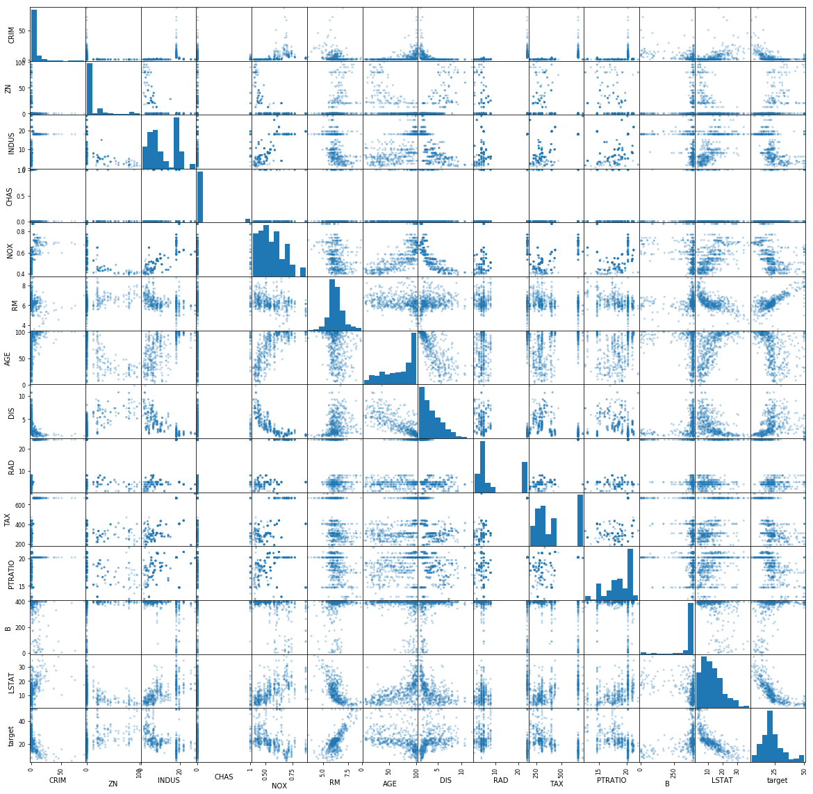
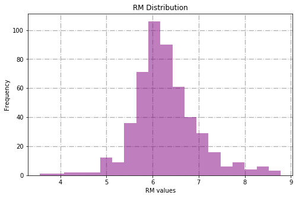
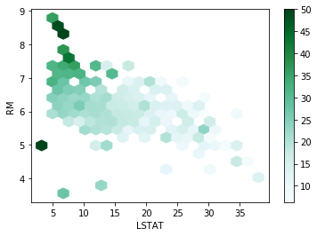

### Questions

### Objectives
YWBAT
* change functions from 'def' format to 'lambda' format
* define the word `api`
* Pandas basics and how to read method chaining
* Plot important aspects of a pandas dataframe using the pandas api
* Create a pivot table in pandas (this will be done on learn.co)

### Activator

Send me the following, in a private zoom chat, please indicate if you're doing level 1 or level 2

Convert this function to a lambda function

**Level 1**

```
def f1(x, y, z):
    s = x + y
    return z*s
```

**Level 2**

```
def f1(x, y, z):
    s = x + y
    z = 0.01 if z == 0 else z
    return z*s
```

<details>
<summary>Solution</summary>
    
**Level 1**

```
f1 = lambda x, y, z: z*(x + y)
```

**Level 2**
```
f1 = lambda x, y, z: z*(x + y) if z !=0 else 0.01*(x + y)
```
</details>


```python
z = 12

z = 0.01 if z == 0 else z

z
```


    12


```python
# Activator notes
f1 = lambda x, y, z: z*(x + y)

f2 = lambda x, y, z: 0.01*(x + y) if z == 0 else z*(x + y)

f3 = lambda x, y, z: (x + y) * (0.01 if z == 0 else z)
```


```python
f2(2, 3, 0.5), f3(2, 3, 0.5)
```


    (2.5, 2.5)


```python
import numpy as np
import pandas as pd

from collections import defaultdict
from sklearn.datasets import load_boston

import matplotlib.pyplot as plt
import seaborn as sns
```

### What is PANDAS?
- it is a python library dedicated towards tools to helping analyze dataframes
    - built on top of numpy


```python
# how to create a dataframe from dictionaries
student1 = {"name": "Melvin", "cereal": "Honey Nut Cheerios"}
student2 = {"name": "Doug", "cereal": "Lucky Charms"}
student3 = {"name": "Andi", "cereal": "Lucky Charms"}
student4 = {"name": "Ice", "cereal": "Captain Crunch"}
student5 = {"name": "Devin", "cereal": "Coco Puffs"}
student6 = {"name": "John L.", "cereal": "Frosted Flakes"}
student7 = {"name": "Terry", "cereal": "Corn Flakes"}

dlist = [student1, student2, student3, student4, student5, student6, student7]

student_df = pd.DataFrame(dlist)
student_df.head()
```


<div>
<style scoped>
    .dataframe tbody tr th:only-of-type {
        vertical-align: middle;
    }

    .dataframe tbody tr th {
        vertical-align: top;
    }

    .dataframe thead th {
        text-align: right;
    }
</style>
<table border="1" class="dataframe">
  <thead>
    <tr style="text-align: right;">
      <th></th>
      <th>name</th>
      <th>cereal</th>
    </tr>
  </thead>
  <tbody>
    <tr>
      <td>0</td>
      <td>Melvin</td>
      <td>Honey Nut Cheerios</td>
    </tr>
    <tr>
      <td>1</td>
      <td>Doug</td>
      <td>Lucky Charms</td>
    </tr>
    <tr>
      <td>2</td>
      <td>Andi</td>
      <td>Lucky Charms</td>
    </tr>
    <tr>
      <td>3</td>
      <td>Ice</td>
      <td>Captain Crunch</td>
    </tr>
    <tr>
      <td>4</td>
      <td>Devin</td>
      <td>Coco Puffs</td>
    </tr>
  </tbody>
</table>
</div>


```python
boston = load_boston()
```


```python
data = boston["data"] # call using dictionary notation
target = boston.target # or use .key_name
columns = list(boston.feature_names)
```


```python
# . calls methods and attributes of the object type
data.shape, target.shape
```


    ((506, 13), (506,))


```python
df = pd.DataFrame(data, columns=columns)
df.head()
```


<div>
<style scoped>
    .dataframe tbody tr th:only-of-type {
        vertical-align: middle;
    }

    .dataframe tbody tr th {
        vertical-align: top;
    }

    .dataframe thead th {
        text-align: right;
    }
</style>
<table border="1" class="dataframe">
  <thead>
    <tr style="text-align: right;">
      <th></th>
      <th>CRIM</th>
      <th>ZN</th>
      <th>INDUS</th>
      <th>CHAS</th>
      <th>NOX</th>
      <th>RM</th>
      <th>AGE</th>
      <th>DIS</th>
      <th>RAD</th>
      <th>TAX</th>
      <th>PTRATIO</th>
      <th>B</th>
      <th>LSTAT</th>
    </tr>
  </thead>
  <tbody>
    <tr>
      <td>0</td>
      <td>0.00632</td>
      <td>18.0</td>
      <td>2.31</td>
      <td>0.0</td>
      <td>0.538</td>
      <td>6.575</td>
      <td>65.2</td>
      <td>4.0900</td>
      <td>1.0</td>
      <td>296.0</td>
      <td>15.3</td>
      <td>396.90</td>
      <td>4.98</td>
    </tr>
    <tr>
      <td>1</td>
      <td>0.02731</td>
      <td>0.0</td>
      <td>7.07</td>
      <td>0.0</td>
      <td>0.469</td>
      <td>6.421</td>
      <td>78.9</td>
      <td>4.9671</td>
      <td>2.0</td>
      <td>242.0</td>
      <td>17.8</td>
      <td>396.90</td>
      <td>9.14</td>
    </tr>
    <tr>
      <td>2</td>
      <td>0.02729</td>
      <td>0.0</td>
      <td>7.07</td>
      <td>0.0</td>
      <td>0.469</td>
      <td>7.185</td>
      <td>61.1</td>
      <td>4.9671</td>
      <td>2.0</td>
      <td>242.0</td>
      <td>17.8</td>
      <td>392.83</td>
      <td>4.03</td>
    </tr>
    <tr>
      <td>3</td>
      <td>0.03237</td>
      <td>0.0</td>
      <td>2.18</td>
      <td>0.0</td>
      <td>0.458</td>
      <td>6.998</td>
      <td>45.8</td>
      <td>6.0622</td>
      <td>3.0</td>
      <td>222.0</td>
      <td>18.7</td>
      <td>394.63</td>
      <td>2.94</td>
    </tr>
    <tr>
      <td>4</td>
      <td>0.06905</td>
      <td>0.0</td>
      <td>2.18</td>
      <td>0.0</td>
      <td>0.458</td>
      <td>7.147</td>
      <td>54.2</td>
      <td>6.0622</td>
      <td>3.0</td>
      <td>222.0</td>
      <td>18.7</td>
      <td>396.90</td>
      <td>5.33</td>
    </tr>
  </tbody>
</table>
</div>


```python
# how do i create a column called target with those nice y values?
df["target"] = target
df.head()
```


<div>
<style scoped>
    .dataframe tbody tr th:only-of-type {
        vertical-align: middle;
    }

    .dataframe tbody tr th {
        vertical-align: top;
    }

    .dataframe thead th {
        text-align: right;
    }
</style>
<table border="1" class="dataframe">
  <thead>
    <tr style="text-align: right;">
      <th></th>
      <th>CRIM</th>
      <th>ZN</th>
      <th>INDUS</th>
      <th>CHAS</th>
      <th>NOX</th>
      <th>RM</th>
      <th>AGE</th>
      <th>DIS</th>
      <th>RAD</th>
      <th>TAX</th>
      <th>PTRATIO</th>
      <th>B</th>
      <th>LSTAT</th>
      <th>target</th>
    </tr>
  </thead>
  <tbody>
    <tr>
      <td>0</td>
      <td>0.00632</td>
      <td>18.0</td>
      <td>2.31</td>
      <td>0.0</td>
      <td>0.538</td>
      <td>6.575</td>
      <td>65.2</td>
      <td>4.0900</td>
      <td>1.0</td>
      <td>296.0</td>
      <td>15.3</td>
      <td>396.90</td>
      <td>4.98</td>
      <td>24.0</td>
    </tr>
    <tr>
      <td>1</td>
      <td>0.02731</td>
      <td>0.0</td>
      <td>7.07</td>
      <td>0.0</td>
      <td>0.469</td>
      <td>6.421</td>
      <td>78.9</td>
      <td>4.9671</td>
      <td>2.0</td>
      <td>242.0</td>
      <td>17.8</td>
      <td>396.90</td>
      <td>9.14</td>
      <td>21.6</td>
    </tr>
    <tr>
      <td>2</td>
      <td>0.02729</td>
      <td>0.0</td>
      <td>7.07</td>
      <td>0.0</td>
      <td>0.469</td>
      <td>7.185</td>
      <td>61.1</td>
      <td>4.9671</td>
      <td>2.0</td>
      <td>242.0</td>
      <td>17.8</td>
      <td>392.83</td>
      <td>4.03</td>
      <td>34.7</td>
    </tr>
    <tr>
      <td>3</td>
      <td>0.03237</td>
      <td>0.0</td>
      <td>2.18</td>
      <td>0.0</td>
      <td>0.458</td>
      <td>6.998</td>
      <td>45.8</td>
      <td>6.0622</td>
      <td>3.0</td>
      <td>222.0</td>
      <td>18.7</td>
      <td>394.63</td>
      <td>2.94</td>
      <td>33.4</td>
    </tr>
    <tr>
      <td>4</td>
      <td>0.06905</td>
      <td>0.0</td>
      <td>2.18</td>
      <td>0.0</td>
      <td>0.458</td>
      <td>7.147</td>
      <td>54.2</td>
      <td>6.0622</td>
      <td>3.0</td>
      <td>222.0</td>
      <td>18.7</td>
      <td>396.90</td>
      <td>5.33</td>
      <td>36.2</td>
    </tr>
  </tbody>
</table>
</div>


```python
# select a group of columns
# CRIM, RM, TAX, target df.loc[rows, columns]
display(df.loc[:, ['CRIM', 'RM', 'TAX', 'target']].head())

display(df[['CRIM', 'RM', 'TAX', 'target']].head())
```


<div>
<style scoped>
    .dataframe tbody tr th:only-of-type {
        vertical-align: middle;
    }

    .dataframe tbody tr th {
        vertical-align: top;
    }

    .dataframe thead th {
        text-align: right;
    }
</style>
<table border="1" class="dataframe">
  <thead>
    <tr style="text-align: right;">
      <th></th>
      <th>CRIM</th>
      <th>RM</th>
      <th>TAX</th>
      <th>target</th>
    </tr>
  </thead>
  <tbody>
    <tr>
      <td>0</td>
      <td>0.00632</td>
      <td>6.575</td>
      <td>296.0</td>
      <td>24.0</td>
    </tr>
    <tr>
      <td>1</td>
      <td>0.02731</td>
      <td>6.421</td>
      <td>242.0</td>
      <td>21.6</td>
    </tr>
    <tr>
      <td>2</td>
      <td>0.02729</td>
      <td>7.185</td>
      <td>242.0</td>
      <td>34.7</td>
    </tr>
    <tr>
      <td>3</td>
      <td>0.03237</td>
      <td>6.998</td>
      <td>222.0</td>
      <td>33.4</td>
    </tr>
    <tr>
      <td>4</td>
      <td>0.06905</td>
      <td>7.147</td>
      <td>222.0</td>
      <td>36.2</td>
    </tr>
  </tbody>
</table>
</div>


<div>
<style scoped>
    .dataframe tbody tr th:only-of-type {
        vertical-align: middle;
    }

    .dataframe tbody tr th {
        vertical-align: top;
    }

    .dataframe thead th {
        text-align: right;
    }
</style>
<table border="1" class="dataframe">
  <thead>
    <tr style="text-align: right;">
      <th></th>
      <th>CRIM</th>
      <th>RM</th>
      <th>TAX</th>
      <th>target</th>
    </tr>
  </thead>
  <tbody>
    <tr>
      <td>0</td>
      <td>0.00632</td>
      <td>6.575</td>
      <td>296.0</td>
      <td>24.0</td>
    </tr>
    <tr>
      <td>1</td>
      <td>0.02731</td>
      <td>6.421</td>
      <td>242.0</td>
      <td>21.6</td>
    </tr>
    <tr>
      <td>2</td>
      <td>0.02729</td>
      <td>7.185</td>
      <td>242.0</td>
      <td>34.7</td>
    </tr>
    <tr>
      <td>3</td>
      <td>0.03237</td>
      <td>6.998</td>
      <td>222.0</td>
      <td>33.4</td>
    </tr>
    <tr>
      <td>4</td>
      <td>0.06905</td>
      <td>7.147</td>
      <td>222.0</td>
      <td>36.2</td>
    </tr>
  </tbody>
</table>
</div>


```python
df['target'] < 30
```


    0       True
    1       True
    2      False
    3      False
    4      False
           ...  
    501     True
    502     True
    503     True
    504     True
    505     True
    Name: target, Length: 506, dtype: bool


```python
# pandas slicing
# get dataf,rame with rows where target < 30
display(df[df['target'] < 30].head(10))


display(df.loc[df['target'] < 30].head(10))
```


<div>
<style scoped>
    .dataframe tbody tr th:only-of-type {
        vertical-align: middle;
    }

    .dataframe tbody tr th {
        vertical-align: top;
    }

    .dataframe thead th {
        text-align: right;
    }
</style>
<table border="1" class="dataframe">
  <thead>
    <tr style="text-align: right;">
      <th></th>
      <th>CRIM</th>
      <th>ZN</th>
      <th>INDUS</th>
      <th>CHAS</th>
      <th>NOX</th>
      <th>RM</th>
      <th>AGE</th>
      <th>DIS</th>
      <th>RAD</th>
      <th>TAX</th>
      <th>PTRATIO</th>
      <th>B</th>
      <th>LSTAT</th>
      <th>target</th>
    </tr>
  </thead>
  <tbody>
    <tr>
      <td>0</td>
      <td>0.00632</td>
      <td>18.0</td>
      <td>2.31</td>
      <td>0.0</td>
      <td>0.538</td>
      <td>6.575</td>
      <td>65.2</td>
      <td>4.0900</td>
      <td>1.0</td>
      <td>296.0</td>
      <td>15.3</td>
      <td>396.90</td>
      <td>4.98</td>
      <td>24.0</td>
    </tr>
    <tr>
      <td>1</td>
      <td>0.02731</td>
      <td>0.0</td>
      <td>7.07</td>
      <td>0.0</td>
      <td>0.469</td>
      <td>6.421</td>
      <td>78.9</td>
      <td>4.9671</td>
      <td>2.0</td>
      <td>242.0</td>
      <td>17.8</td>
      <td>396.90</td>
      <td>9.14</td>
      <td>21.6</td>
    </tr>
    <tr>
      <td>5</td>
      <td>0.02985</td>
      <td>0.0</td>
      <td>2.18</td>
      <td>0.0</td>
      <td>0.458</td>
      <td>6.430</td>
      <td>58.7</td>
      <td>6.0622</td>
      <td>3.0</td>
      <td>222.0</td>
      <td>18.7</td>
      <td>394.12</td>
      <td>5.21</td>
      <td>28.7</td>
    </tr>
    <tr>
      <td>6</td>
      <td>0.08829</td>
      <td>12.5</td>
      <td>7.87</td>
      <td>0.0</td>
      <td>0.524</td>
      <td>6.012</td>
      <td>66.6</td>
      <td>5.5605</td>
      <td>5.0</td>
      <td>311.0</td>
      <td>15.2</td>
      <td>395.60</td>
      <td>12.43</td>
      <td>22.9</td>
    </tr>
    <tr>
      <td>7</td>
      <td>0.14455</td>
      <td>12.5</td>
      <td>7.87</td>
      <td>0.0</td>
      <td>0.524</td>
      <td>6.172</td>
      <td>96.1</td>
      <td>5.9505</td>
      <td>5.0</td>
      <td>311.0</td>
      <td>15.2</td>
      <td>396.90</td>
      <td>19.15</td>
      <td>27.1</td>
    </tr>
    <tr>
      <td>8</td>
      <td>0.21124</td>
      <td>12.5</td>
      <td>7.87</td>
      <td>0.0</td>
      <td>0.524</td>
      <td>5.631</td>
      <td>100.0</td>
      <td>6.0821</td>
      <td>5.0</td>
      <td>311.0</td>
      <td>15.2</td>
      <td>386.63</td>
      <td>29.93</td>
      <td>16.5</td>
    </tr>
    <tr>
      <td>9</td>
      <td>0.17004</td>
      <td>12.5</td>
      <td>7.87</td>
      <td>0.0</td>
      <td>0.524</td>
      <td>6.004</td>
      <td>85.9</td>
      <td>6.5921</td>
      <td>5.0</td>
      <td>311.0</td>
      <td>15.2</td>
      <td>386.71</td>
      <td>17.10</td>
      <td>18.9</td>
    </tr>
    <tr>
      <td>10</td>
      <td>0.22489</td>
      <td>12.5</td>
      <td>7.87</td>
      <td>0.0</td>
      <td>0.524</td>
      <td>6.377</td>
      <td>94.3</td>
      <td>6.3467</td>
      <td>5.0</td>
      <td>311.0</td>
      <td>15.2</td>
      <td>392.52</td>
      <td>20.45</td>
      <td>15.0</td>
    </tr>
    <tr>
      <td>11</td>
      <td>0.11747</td>
      <td>12.5</td>
      <td>7.87</td>
      <td>0.0</td>
      <td>0.524</td>
      <td>6.009</td>
      <td>82.9</td>
      <td>6.2267</td>
      <td>5.0</td>
      <td>311.0</td>
      <td>15.2</td>
      <td>396.90</td>
      <td>13.27</td>
      <td>18.9</td>
    </tr>
    <tr>
      <td>12</td>
      <td>0.09378</td>
      <td>12.5</td>
      <td>7.87</td>
      <td>0.0</td>
      <td>0.524</td>
      <td>5.889</td>
      <td>39.0</td>
      <td>5.4509</td>
      <td>5.0</td>
      <td>311.0</td>
      <td>15.2</td>
      <td>390.50</td>
      <td>15.71</td>
      <td>21.7</td>
    </tr>
  </tbody>
</table>
</div>


<div>
<style scoped>
    .dataframe tbody tr th:only-of-type {
        vertical-align: middle;
    }

    .dataframe tbody tr th {
        vertical-align: top;
    }

    .dataframe thead th {
        text-align: right;
    }
</style>
<table border="1" class="dataframe">
  <thead>
    <tr style="text-align: right;">
      <th></th>
      <th>CRIM</th>
      <th>ZN</th>
      <th>INDUS</th>
      <th>CHAS</th>
      <th>NOX</th>
      <th>RM</th>
      <th>AGE</th>
      <th>DIS</th>
      <th>RAD</th>
      <th>TAX</th>
      <th>PTRATIO</th>
      <th>B</th>
      <th>LSTAT</th>
      <th>target</th>
    </tr>
  </thead>
  <tbody>
    <tr>
      <td>0</td>
      <td>0.00632</td>
      <td>18.0</td>
      <td>2.31</td>
      <td>0.0</td>
      <td>0.538</td>
      <td>6.575</td>
      <td>65.2</td>
      <td>4.0900</td>
      <td>1.0</td>
      <td>296.0</td>
      <td>15.3</td>
      <td>396.90</td>
      <td>4.98</td>
      <td>24.0</td>
    </tr>
    <tr>
      <td>1</td>
      <td>0.02731</td>
      <td>0.0</td>
      <td>7.07</td>
      <td>0.0</td>
      <td>0.469</td>
      <td>6.421</td>
      <td>78.9</td>
      <td>4.9671</td>
      <td>2.0</td>
      <td>242.0</td>
      <td>17.8</td>
      <td>396.90</td>
      <td>9.14</td>
      <td>21.6</td>
    </tr>
    <tr>
      <td>5</td>
      <td>0.02985</td>
      <td>0.0</td>
      <td>2.18</td>
      <td>0.0</td>
      <td>0.458</td>
      <td>6.430</td>
      <td>58.7</td>
      <td>6.0622</td>
      <td>3.0</td>
      <td>222.0</td>
      <td>18.7</td>
      <td>394.12</td>
      <td>5.21</td>
      <td>28.7</td>
    </tr>
    <tr>
      <td>6</td>
      <td>0.08829</td>
      <td>12.5</td>
      <td>7.87</td>
      <td>0.0</td>
      <td>0.524</td>
      <td>6.012</td>
      <td>66.6</td>
      <td>5.5605</td>
      <td>5.0</td>
      <td>311.0</td>
      <td>15.2</td>
      <td>395.60</td>
      <td>12.43</td>
      <td>22.9</td>
    </tr>
    <tr>
      <td>7</td>
      <td>0.14455</td>
      <td>12.5</td>
      <td>7.87</td>
      <td>0.0</td>
      <td>0.524</td>
      <td>6.172</td>
      <td>96.1</td>
      <td>5.9505</td>
      <td>5.0</td>
      <td>311.0</td>
      <td>15.2</td>
      <td>396.90</td>
      <td>19.15</td>
      <td>27.1</td>
    </tr>
    <tr>
      <td>8</td>
      <td>0.21124</td>
      <td>12.5</td>
      <td>7.87</td>
      <td>0.0</td>
      <td>0.524</td>
      <td>5.631</td>
      <td>100.0</td>
      <td>6.0821</td>
      <td>5.0</td>
      <td>311.0</td>
      <td>15.2</td>
      <td>386.63</td>
      <td>29.93</td>
      <td>16.5</td>
    </tr>
    <tr>
      <td>9</td>
      <td>0.17004</td>
      <td>12.5</td>
      <td>7.87</td>
      <td>0.0</td>
      <td>0.524</td>
      <td>6.004</td>
      <td>85.9</td>
      <td>6.5921</td>
      <td>5.0</td>
      <td>311.0</td>
      <td>15.2</td>
      <td>386.71</td>
      <td>17.10</td>
      <td>18.9</td>
    </tr>
    <tr>
      <td>10</td>
      <td>0.22489</td>
      <td>12.5</td>
      <td>7.87</td>
      <td>0.0</td>
      <td>0.524</td>
      <td>6.377</td>
      <td>94.3</td>
      <td>6.3467</td>
      <td>5.0</td>
      <td>311.0</td>
      <td>15.2</td>
      <td>392.52</td>
      <td>20.45</td>
      <td>15.0</td>
    </tr>
    <tr>
      <td>11</td>
      <td>0.11747</td>
      <td>12.5</td>
      <td>7.87</td>
      <td>0.0</td>
      <td>0.524</td>
      <td>6.009</td>
      <td>82.9</td>
      <td>6.2267</td>
      <td>5.0</td>
      <td>311.0</td>
      <td>15.2</td>
      <td>396.90</td>
      <td>13.27</td>
      <td>18.9</td>
    </tr>
    <tr>
      <td>12</td>
      <td>0.09378</td>
      <td>12.5</td>
      <td>7.87</td>
      <td>0.0</td>
      <td>0.524</td>
      <td>5.889</td>
      <td>39.0</td>
      <td>5.4509</td>
      <td>5.0</td>
      <td>311.0</td>
      <td>15.2</td>
      <td>390.50</td>
      <td>15.71</td>
      <td>21.7</td>
    </tr>
  </tbody>
</table>
</div>


```python
# pandas slicing on multiple conditions
# target < 30 and age > 80
df.loc[(df['target'] < 30) & (df['AGE'] > 80)]
```


<div>
<style scoped>
    .dataframe tbody tr th:only-of-type {
        vertical-align: middle;
    }

    .dataframe tbody tr th {
        vertical-align: top;
    }

    .dataframe thead th {
        text-align: right;
    }
</style>
<table border="1" class="dataframe">
  <thead>
    <tr style="text-align: right;">
      <th></th>
      <th>CRIM</th>
      <th>ZN</th>
      <th>INDUS</th>
      <th>CHAS</th>
      <th>NOX</th>
      <th>RM</th>
      <th>AGE</th>
      <th>DIS</th>
      <th>RAD</th>
      <th>TAX</th>
      <th>PTRATIO</th>
      <th>B</th>
      <th>LSTAT</th>
      <th>target</th>
    </tr>
  </thead>
  <tbody>
    <tr>
      <td>7</td>
      <td>0.14455</td>
      <td>12.5</td>
      <td>7.87</td>
      <td>0.0</td>
      <td>0.524</td>
      <td>6.172</td>
      <td>96.1</td>
      <td>5.9505</td>
      <td>5.0</td>
      <td>311.0</td>
      <td>15.2</td>
      <td>396.90</td>
      <td>19.15</td>
      <td>27.1</td>
    </tr>
    <tr>
      <td>8</td>
      <td>0.21124</td>
      <td>12.5</td>
      <td>7.87</td>
      <td>0.0</td>
      <td>0.524</td>
      <td>5.631</td>
      <td>100.0</td>
      <td>6.0821</td>
      <td>5.0</td>
      <td>311.0</td>
      <td>15.2</td>
      <td>386.63</td>
      <td>29.93</td>
      <td>16.5</td>
    </tr>
    <tr>
      <td>9</td>
      <td>0.17004</td>
      <td>12.5</td>
      <td>7.87</td>
      <td>0.0</td>
      <td>0.524</td>
      <td>6.004</td>
      <td>85.9</td>
      <td>6.5921</td>
      <td>5.0</td>
      <td>311.0</td>
      <td>15.2</td>
      <td>386.71</td>
      <td>17.10</td>
      <td>18.9</td>
    </tr>
    <tr>
      <td>10</td>
      <td>0.22489</td>
      <td>12.5</td>
      <td>7.87</td>
      <td>0.0</td>
      <td>0.524</td>
      <td>6.377</td>
      <td>94.3</td>
      <td>6.3467</td>
      <td>5.0</td>
      <td>311.0</td>
      <td>15.2</td>
      <td>392.52</td>
      <td>20.45</td>
      <td>15.0</td>
    </tr>
    <tr>
      <td>11</td>
      <td>0.11747</td>
      <td>12.5</td>
      <td>7.87</td>
      <td>0.0</td>
      <td>0.524</td>
      <td>6.009</td>
      <td>82.9</td>
      <td>6.2267</td>
      <td>5.0</td>
      <td>311.0</td>
      <td>15.2</td>
      <td>396.90</td>
      <td>13.27</td>
      <td>18.9</td>
    </tr>
    <tr>
      <td>...</td>
      <td>...</td>
      <td>...</td>
      <td>...</td>
      <td>...</td>
      <td>...</td>
      <td>...</td>
      <td>...</td>
      <td>...</td>
      <td>...</td>
      <td>...</td>
      <td>...</td>
      <td>...</td>
      <td>...</td>
      <td>...</td>
    </tr>
    <tr>
      <td>491</td>
      <td>0.10574</td>
      <td>0.0</td>
      <td>27.74</td>
      <td>0.0</td>
      <td>0.609</td>
      <td>5.983</td>
      <td>98.8</td>
      <td>1.8681</td>
      <td>4.0</td>
      <td>711.0</td>
      <td>20.1</td>
      <td>390.11</td>
      <td>18.07</td>
      <td>13.6</td>
    </tr>
    <tr>
      <td>492</td>
      <td>0.11132</td>
      <td>0.0</td>
      <td>27.74</td>
      <td>0.0</td>
      <td>0.609</td>
      <td>5.983</td>
      <td>83.5</td>
      <td>2.1099</td>
      <td>4.0</td>
      <td>711.0</td>
      <td>20.1</td>
      <td>396.90</td>
      <td>13.35</td>
      <td>20.1</td>
    </tr>
    <tr>
      <td>503</td>
      <td>0.06076</td>
      <td>0.0</td>
      <td>11.93</td>
      <td>0.0</td>
      <td>0.573</td>
      <td>6.976</td>
      <td>91.0</td>
      <td>2.1675</td>
      <td>1.0</td>
      <td>273.0</td>
      <td>21.0</td>
      <td>396.90</td>
      <td>5.64</td>
      <td>23.9</td>
    </tr>
    <tr>
      <td>504</td>
      <td>0.10959</td>
      <td>0.0</td>
      <td>11.93</td>
      <td>0.0</td>
      <td>0.573</td>
      <td>6.794</td>
      <td>89.3</td>
      <td>2.3889</td>
      <td>1.0</td>
      <td>273.0</td>
      <td>21.0</td>
      <td>393.45</td>
      <td>6.48</td>
      <td>22.0</td>
    </tr>
    <tr>
      <td>505</td>
      <td>0.04741</td>
      <td>0.0</td>
      <td>11.93</td>
      <td>0.0</td>
      <td>0.573</td>
      <td>6.030</td>
      <td>80.8</td>
      <td>2.5050</td>
      <td>1.0</td>
      <td>273.0</td>
      <td>21.0</td>
      <td>396.90</td>
      <td>7.88</td>
      <td>11.9</td>
    </tr>
  </tbody>
</table>
<p>215 rows × 14 columns</p>
</div>


```python
# pandas slicing on mult. conditions for specific columns
# target > 30 and age > 75 but only grab the target and age columns
display(df.loc[(df['target'] < 30) & (df['AGE'] > 75), ['AGE', 'target']].head())

display(df.loc[(df['target'] < 30) & (df['AGE'] > 75)][['AGE', 'target']].head())
```


<div>
<style scoped>
    .dataframe tbody tr th:only-of-type {
        vertical-align: middle;
    }

    .dataframe tbody tr th {
        vertical-align: top;
    }

    .dataframe thead th {
        text-align: right;
    }
</style>
<table border="1" class="dataframe">
  <thead>
    <tr style="text-align: right;">
      <th></th>
      <th>AGE</th>
      <th>target</th>
    </tr>
  </thead>
  <tbody>
    <tr>
      <td>1</td>
      <td>78.9</td>
      <td>21.6</td>
    </tr>
    <tr>
      <td>7</td>
      <td>96.1</td>
      <td>27.1</td>
    </tr>
    <tr>
      <td>8</td>
      <td>100.0</td>
      <td>16.5</td>
    </tr>
    <tr>
      <td>9</td>
      <td>85.9</td>
      <td>18.9</td>
    </tr>
    <tr>
      <td>10</td>
      <td>94.3</td>
      <td>15.0</td>
    </tr>
  </tbody>
</table>
</div>


<div>
<style scoped>
    .dataframe tbody tr th:only-of-type {
        vertical-align: middle;
    }

    .dataframe tbody tr th {
        vertical-align: top;
    }

    .dataframe thead th {
        text-align: right;
    }
</style>
<table border="1" class="dataframe">
  <thead>
    <tr style="text-align: right;">
      <th></th>
      <th>AGE</th>
      <th>target</th>
    </tr>
  </thead>
  <tbody>
    <tr>
      <td>1</td>
      <td>78.9</td>
      <td>21.6</td>
    </tr>
    <tr>
      <td>7</td>
      <td>96.1</td>
      <td>27.1</td>
    </tr>
    <tr>
      <td>8</td>
      <td>100.0</td>
      <td>16.5</td>
    </tr>
    <tr>
      <td>9</td>
      <td>85.9</td>
      <td>18.9</td>
    </tr>
    <tr>
      <td>10</td>
      <td>94.3</td>
      <td>15.0</td>
    </tr>
  </tbody>
</table>
</div>


```python
# pandas slicing on mult. conditions for specific columns
# target > 30 and age > 75 but only grab the CRIM
display(df.loc[(df['target'] < 30) & (df['AGE'] > 75), ['CRIM']].head())


display(df.loc[(df['target'] < 30) & (df['AGE'] > 75)][['CRIM']].head())
```


<div>
<style scoped>
    .dataframe tbody tr th:only-of-type {
        vertical-align: middle;
    }

    .dataframe tbody tr th {
        vertical-align: top;
    }

    .dataframe thead th {
        text-align: right;
    }
</style>
<table border="1" class="dataframe">
  <thead>
    <tr style="text-align: right;">
      <th></th>
      <th>CRIM</th>
    </tr>
  </thead>
  <tbody>
    <tr>
      <td>1</td>
      <td>0.02731</td>
    </tr>
    <tr>
      <td>7</td>
      <td>0.14455</td>
    </tr>
    <tr>
      <td>8</td>
      <td>0.21124</td>
    </tr>
    <tr>
      <td>9</td>
      <td>0.17004</td>
    </tr>
    <tr>
      <td>10</td>
      <td>0.22489</td>
    </tr>
  </tbody>
</table>
</div>


<div>
<style scoped>
    .dataframe tbody tr th:only-of-type {
        vertical-align: middle;
    }

    .dataframe tbody tr th {
        vertical-align: top;
    }

    .dataframe thead th {
        text-align: right;
    }
</style>
<table border="1" class="dataframe">
  <thead>
    <tr style="text-align: right;">
      <th></th>
      <th>CRIM</th>
    </tr>
  </thead>
  <tbody>
    <tr>
      <td>1</td>
      <td>0.02731</td>
    </tr>
    <tr>
      <td>7</td>
      <td>0.14455</td>
    </tr>
    <tr>
      <td>8</td>
      <td>0.21124</td>
    </tr>
    <tr>
      <td>9</td>
      <td>0.17004</td>
    </tr>
    <tr>
      <td>10</td>
      <td>0.22489</td>
    </tr>
  </tbody>
</table>
</div>


```python
# Plot a scattermatrix of your dataframe
pd.plotting.scatter_matrix(df, figsize=(20, 20), diagonal='hist', marker='.', alpha=0.3)
plt.show()
```





```python
# Make a function that plots a specific column of the dataframe as a histogram
# Make the color of it purple by default, alpha value should be 0.8 by default
# Make a parameter to toggle a grid
# Make parameters for axis labels and the title of the histogram
# Make a parameter for number of bins and default it to 20
# call the function `plot_histogram`

def plot_column(column_name, bins=20, color='purple', alpha=0.5, grid_linestyle='dashed'):
    plt.figure(figsize=(8, 5))
    plt.hist(df[column_name], bins=bins, color=color, alpha=alpha, zorder=2)
    plt.grid(zorder=0, linestyle=grid_linestyle, linewidth=1.3)
    plt.title(f"{column_name} Distribution")
    plt.xlabel(f"{column_name} values")
    plt.ylabel("Frequency")
    plt.show()
```


```python
plot_column('RM', grid_linestyle='-.')
```





```python
# Plot a hexbin plot of AGE vs RM colored by target values
# plots 2 features (x, y axis) and colors by your target

sliced_df = df.loc[(df['LSTAT'] >= 5) | (df['RM']<=6)]
sliced_df.plot.hexbin(x='LSTAT', y='RM', C='target', gridsize=20)
plt.show()
```





```python
df.RM.mean() + 3*df.RM.std(), df.RM.mean() - 3*df.RM.std()
```


    (8.392485817597748, 4.176782957105809)


```python

```


```python

```


```python

```


```python

```

### Assessment
* what is the different between a list object and a numpy.array object?
* what is the benefit of using numpy vs writing your own methods?
* what is the index of a dataframe? What is a rule for the index? What are columns? 
* how do we find the mean of a specific column in a dataframe?
* plot a hist, scatterplot, lineplot, hexmap, heatmap


```python

```
