### Questions
- all of the questions

### Objectives
YWBAT
* change functions from 'def' format to 'lambda' format (n/a)
* Pandas basics and how to read method chaining
* define the word `api`
* Plot important aspects of a pandas dataframe using the pandas api
* Create a pivot table in pandas (this will be done on learn.co)

#### What is pandas? Why do we use it?

In Data Science you have data structures. 
Examples:
- dictionary
- list
- array
- csv file
- tuple
- excel file
- spreadsheets
- html files
- json files


In order to interact with these files, we can either do it using string manipulation


But now get pandas! Pandas can interact with almost all of these files! 


```python
file = open("demo.csv").read()
file
```


    'column1, column2, column3\n0, 1, 2\n1, 2, 3\n3, 4, 5\n6, 7, 8\n9, 10, 11\n'


```python
file_elements = file.replace("\n", ",").split(",")
file_elements
```


    ['column1',
     ' column2',
     ' column3',
     '0',
     ' 1',
     ' 2',
     '1',
     ' 2',
     ' 3',
     '3',
     ' 4',
     ' 5',
     '6',
     ' 7',
     ' 8',
     '9',
     ' 10',
     ' 11',
     '']


```python
for index, value in enumerate(file_elements):
    if index%3==0:
        print(value)
```

    column1
    0
    1
    3
    6
    9
    


```python
demo_df = pd.read_csv("demo.csv")
demo_df.head(3)
```


<div>
<style scoped>
    .dataframe tbody tr th:only-of-type {
        vertical-align: middle;
    }

    .dataframe tbody tr th {
        vertical-align: top;
    }

    .dataframe thead th {
        text-align: right;
    }
</style>
<table border="1" class="dataframe">
  <thead>
    <tr style="text-align: right;">
      <th></th>
      <th>column1</th>
      <th>column2</th>
      <th>column3</th>
    </tr>
  </thead>
  <tbody>
    <tr>
      <td>0</td>
      <td>0</td>
      <td>1</td>
      <td>2</td>
    </tr>
    <tr>
      <td>1</td>
      <td>1</td>
      <td>2</td>
      <td>3</td>
    </tr>
    <tr>
      <td>2</td>
      <td>3</td>
      <td>4</td>
      <td>5</td>
    </tr>
  </tbody>
</table>
</div>


### Activator

Send me the following, in a private zoom chat, please indicate if you're doing level 1 or level 2

Convert this function to a lambda function

**Level 1**

```
def f1(x, y, z):
    s = x + y
    return z*s
```

**Level 2**

```
def f1(x, y, z):
    s = x + y
    z = 0.01 if z == 0 else z
    return z*s
```

<details>
<summary>Solution</summary>
    
**Level 1**

```
f1 = lambda x, y, z: z*(x + y)
```

**Level 2**
```
f1 = lambda x, y, z: z*(x + y) if z !=0 else 0.01*(x + y)

f1 = lambda x, y, z: (0.01 if z == 0 else z) * (x+y)
```
</details>


```python
import numpy as np
import pandas as pd

from collections import defaultdict
from sklearn.datasets import load_boston

import matplotlib.pyplot as plt
import seaborn as sns
```


```python
boston = load_boston()
```


```python
data = boston["data"] # call using dictionary notation
target = boston.target # y values
columns = list(boston.feature_names)
```


```python
data.shape, target.shape
```


    ((506, 13), (506,))


```python
# . calls methods and attributes of the object type
data.shape, target.shape

# what does (506,) mean? Numpy is interpreting the array as a vector and not a matrix
# 506 x 1, but the 1 is missing because this is a vector and not a matrix
```


    ((506, 13), (506,))


```python
df = pd.DataFrame(data, columns=columns)
df.head()
```


<div>
<style scoped>
    .dataframe tbody tr th:only-of-type {
        vertical-align: middle;
    }

    .dataframe tbody tr th {
        vertical-align: top;
    }

    .dataframe thead th {
        text-align: right;
    }
</style>
<table border="1" class="dataframe">
  <thead>
    <tr style="text-align: right;">
      <th></th>
      <th>CRIM</th>
      <th>ZN</th>
      <th>INDUS</th>
      <th>CHAS</th>
      <th>NOX</th>
      <th>RM</th>
      <th>AGE</th>
      <th>DIS</th>
      <th>RAD</th>
      <th>TAX</th>
      <th>PTRATIO</th>
      <th>B</th>
      <th>LSTAT</th>
    </tr>
  </thead>
  <tbody>
    <tr>
      <td>0</td>
      <td>0.00632</td>
      <td>18.0</td>
      <td>2.31</td>
      <td>0.0</td>
      <td>0.538</td>
      <td>6.575</td>
      <td>65.2</td>
      <td>4.0900</td>
      <td>1.0</td>
      <td>296.0</td>
      <td>15.3</td>
      <td>396.90</td>
      <td>4.98</td>
    </tr>
    <tr>
      <td>1</td>
      <td>0.02731</td>
      <td>0.0</td>
      <td>7.07</td>
      <td>0.0</td>
      <td>0.469</td>
      <td>6.421</td>
      <td>78.9</td>
      <td>4.9671</td>
      <td>2.0</td>
      <td>242.0</td>
      <td>17.8</td>
      <td>396.90</td>
      <td>9.14</td>
    </tr>
    <tr>
      <td>2</td>
      <td>0.02729</td>
      <td>0.0</td>
      <td>7.07</td>
      <td>0.0</td>
      <td>0.469</td>
      <td>7.185</td>
      <td>61.1</td>
      <td>4.9671</td>
      <td>2.0</td>
      <td>242.0</td>
      <td>17.8</td>
      <td>392.83</td>
      <td>4.03</td>
    </tr>
    <tr>
      <td>3</td>
      <td>0.03237</td>
      <td>0.0</td>
      <td>2.18</td>
      <td>0.0</td>
      <td>0.458</td>
      <td>6.998</td>
      <td>45.8</td>
      <td>6.0622</td>
      <td>3.0</td>
      <td>222.0</td>
      <td>18.7</td>
      <td>394.63</td>
      <td>2.94</td>
    </tr>
    <tr>
      <td>4</td>
      <td>0.06905</td>
      <td>0.0</td>
      <td>2.18</td>
      <td>0.0</td>
      <td>0.458</td>
      <td>7.147</td>
      <td>54.2</td>
      <td>6.0622</td>
      <td>3.0</td>
      <td>222.0</td>
      <td>18.7</td>
      <td>396.90</td>
      <td>5.33</td>
    </tr>
  </tbody>
</table>
</div>


```python
# how do i create a column called target with those nice y values?
df["target"] = target
df.head()
```


<div>
<style scoped>
    .dataframe tbody tr th:only-of-type {
        vertical-align: middle;
    }

    .dataframe tbody tr th {
        vertical-align: top;
    }

    .dataframe thead th {
        text-align: right;
    }
</style>
<table border="1" class="dataframe">
  <thead>
    <tr style="text-align: right;">
      <th></th>
      <th>CRIM</th>
      <th>ZN</th>
      <th>INDUS</th>
      <th>CHAS</th>
      <th>NOX</th>
      <th>RM</th>
      <th>AGE</th>
      <th>DIS</th>
      <th>RAD</th>
      <th>TAX</th>
      <th>PTRATIO</th>
      <th>B</th>
      <th>LSTAT</th>
      <th>target</th>
    </tr>
  </thead>
  <tbody>
    <tr>
      <td>0</td>
      <td>0.00632</td>
      <td>18.0</td>
      <td>2.31</td>
      <td>0.0</td>
      <td>0.538</td>
      <td>6.575</td>
      <td>65.2</td>
      <td>4.0900</td>
      <td>1.0</td>
      <td>296.0</td>
      <td>15.3</td>
      <td>396.90</td>
      <td>4.98</td>
      <td>24.0</td>
    </tr>
    <tr>
      <td>1</td>
      <td>0.02731</td>
      <td>0.0</td>
      <td>7.07</td>
      <td>0.0</td>
      <td>0.469</td>
      <td>6.421</td>
      <td>78.9</td>
      <td>4.9671</td>
      <td>2.0</td>
      <td>242.0</td>
      <td>17.8</td>
      <td>396.90</td>
      <td>9.14</td>
      <td>21.6</td>
    </tr>
    <tr>
      <td>2</td>
      <td>0.02729</td>
      <td>0.0</td>
      <td>7.07</td>
      <td>0.0</td>
      <td>0.469</td>
      <td>7.185</td>
      <td>61.1</td>
      <td>4.9671</td>
      <td>2.0</td>
      <td>242.0</td>
      <td>17.8</td>
      <td>392.83</td>
      <td>4.03</td>
      <td>34.7</td>
    </tr>
    <tr>
      <td>3</td>
      <td>0.03237</td>
      <td>0.0</td>
      <td>2.18</td>
      <td>0.0</td>
      <td>0.458</td>
      <td>6.998</td>
      <td>45.8</td>
      <td>6.0622</td>
      <td>3.0</td>
      <td>222.0</td>
      <td>18.7</td>
      <td>394.63</td>
      <td>2.94</td>
      <td>33.4</td>
    </tr>
    <tr>
      <td>4</td>
      <td>0.06905</td>
      <td>0.0</td>
      <td>2.18</td>
      <td>0.0</td>
      <td>0.458</td>
      <td>7.147</td>
      <td>54.2</td>
      <td>6.0622</td>
      <td>3.0</td>
      <td>222.0</td>
      <td>18.7</td>
      <td>396.90</td>
      <td>5.33</td>
      <td>36.2</td>
    </tr>
  </tbody>
</table>
</div>


### How can we get to know our data?

```
df.describe()

df.info()
```


```python
df.info()

# what is this telling us?
# number of entires per column
# data types, in this case float64
# memory size: 55.5 KB
# Object Type -> DataFrame,TimeSeries
```

    <class 'pandas.core.frame.DataFrame'>
    RangeIndex: 506 entries, 0 to 505
    Data columns (total 14 columns):
    CRIM       506 non-null float64
    ZN         506 non-null float64
    INDUS      506 non-null float64
    CHAS       506 non-null float64
    NOX        506 non-null float64
    RM         506 non-null float64
    AGE        506 non-null float64
    DIS        506 non-null float64
    RAD        506 non-null float64
    TAX        506 non-null float64
    PTRATIO    506 non-null float64
    B          506 non-null float64
    LSTAT      506 non-null float64
    target     506 non-null float64
    dtypes: float64(14)
    memory usage: 55.5 KB


```python
df.describe()

# What is this telling us?
# .describe() tells us statistics about the data
# the 'shape' of the data
# 5 point statistics on the data for each column
```


<div>
<style scoped>
    .dataframe tbody tr th:only-of-type {
        vertical-align: middle;
    }

    .dataframe tbody tr th {
        vertical-align: top;
    }

    .dataframe thead th {
        text-align: right;
    }
</style>
<table border="1" class="dataframe">
  <thead>
    <tr style="text-align: right;">
      <th></th>
      <th>CRIM</th>
      <th>ZN</th>
      <th>INDUS</th>
      <th>CHAS</th>
      <th>NOX</th>
      <th>RM</th>
      <th>AGE</th>
      <th>DIS</th>
      <th>RAD</th>
      <th>TAX</th>
      <th>PTRATIO</th>
      <th>B</th>
      <th>LSTAT</th>
      <th>target</th>
    </tr>
  </thead>
  <tbody>
    <tr>
      <td>count</td>
      <td>506.000000</td>
      <td>506.000000</td>
      <td>506.000000</td>
      <td>506.000000</td>
      <td>506.000000</td>
      <td>506.000000</td>
      <td>506.000000</td>
      <td>506.000000</td>
      <td>506.000000</td>
      <td>506.000000</td>
      <td>506.000000</td>
      <td>506.000000</td>
      <td>506.000000</td>
      <td>506.000000</td>
    </tr>
    <tr>
      <td>mean</td>
      <td>3.613524</td>
      <td>11.363636</td>
      <td>11.136779</td>
      <td>0.069170</td>
      <td>0.554695</td>
      <td>6.284634</td>
      <td>68.574901</td>
      <td>3.795043</td>
      <td>9.549407</td>
      <td>408.237154</td>
      <td>18.455534</td>
      <td>356.674032</td>
      <td>12.653063</td>
      <td>22.532806</td>
    </tr>
    <tr>
      <td>std</td>
      <td>8.601545</td>
      <td>23.322453</td>
      <td>6.860353</td>
      <td>0.253994</td>
      <td>0.115878</td>
      <td>0.702617</td>
      <td>28.148861</td>
      <td>2.105710</td>
      <td>8.707259</td>
      <td>168.537116</td>
      <td>2.164946</td>
      <td>91.294864</td>
      <td>7.141062</td>
      <td>9.197104</td>
    </tr>
    <tr>
      <td>min</td>
      <td>0.006320</td>
      <td>0.000000</td>
      <td>0.460000</td>
      <td>0.000000</td>
      <td>0.385000</td>
      <td>3.561000</td>
      <td>2.900000</td>
      <td>1.129600</td>
      <td>1.000000</td>
      <td>187.000000</td>
      <td>12.600000</td>
      <td>0.320000</td>
      <td>1.730000</td>
      <td>5.000000</td>
    </tr>
    <tr>
      <td>25%</td>
      <td>0.082045</td>
      <td>0.000000</td>
      <td>5.190000</td>
      <td>0.000000</td>
      <td>0.449000</td>
      <td>5.885500</td>
      <td>45.025000</td>
      <td>2.100175</td>
      <td>4.000000</td>
      <td>279.000000</td>
      <td>17.400000</td>
      <td>375.377500</td>
      <td>6.950000</td>
      <td>17.025000</td>
    </tr>
    <tr>
      <td>50%</td>
      <td>0.256510</td>
      <td>0.000000</td>
      <td>9.690000</td>
      <td>0.000000</td>
      <td>0.538000</td>
      <td>6.208500</td>
      <td>77.500000</td>
      <td>3.207450</td>
      <td>5.000000</td>
      <td>330.000000</td>
      <td>19.050000</td>
      <td>391.440000</td>
      <td>11.360000</td>
      <td>21.200000</td>
    </tr>
    <tr>
      <td>75%</td>
      <td>3.677083</td>
      <td>12.500000</td>
      <td>18.100000</td>
      <td>0.000000</td>
      <td>0.624000</td>
      <td>6.623500</td>
      <td>94.075000</td>
      <td>5.188425</td>
      <td>24.000000</td>
      <td>666.000000</td>
      <td>20.200000</td>
      <td>396.225000</td>
      <td>16.955000</td>
      <td>25.000000</td>
    </tr>
    <tr>
      <td>max</td>
      <td>88.976200</td>
      <td>100.000000</td>
      <td>27.740000</td>
      <td>1.000000</td>
      <td>0.871000</td>
      <td>8.780000</td>
      <td>100.000000</td>
      <td>12.126500</td>
      <td>24.000000</td>
      <td>711.000000</td>
      <td>22.000000</td>
      <td>396.900000</td>
      <td>37.970000</td>
      <td>50.000000</td>
    </tr>
  </tbody>
</table>
</div>


```python
df.columns
```


    Index(['CRIM', 'ZN', 'INDUS', 'CHAS', 'NOX', 'RM', 'AGE', 'DIS', 'RAD', 'TAX',
           'PTRATIO', 'B', 'LSTAT', 'target'],
          dtype='object')


```python
for col in df.columns:
    plt.figure(figsize=(5, 3))
    plt.hist(df[col], bins=20)
    plt.title(col)
    plt.show()
```


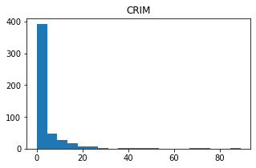


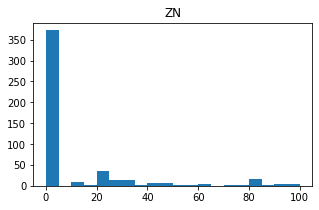


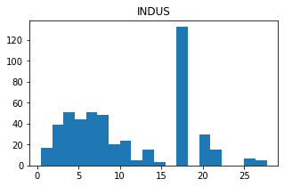


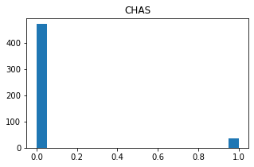


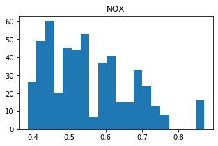


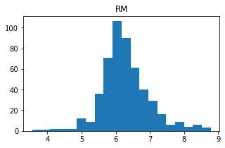


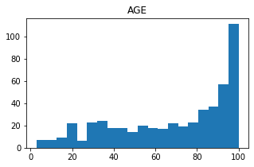


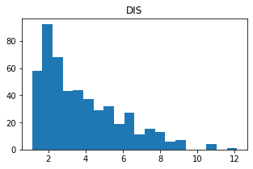


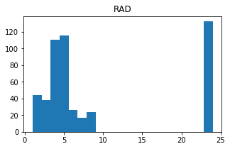


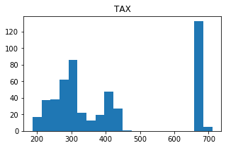


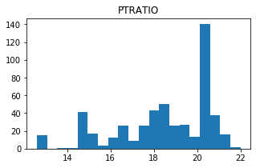


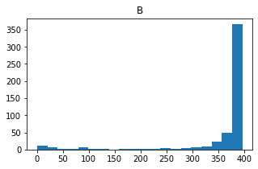


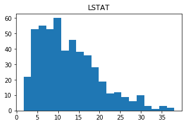


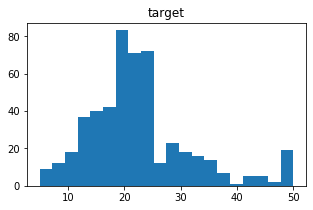


```python
# let's make some categorical data by creating a new column

# let's make a new column by making a list of the same shape

room_categories = []

for rm in df.RM:
    if rm < 6:
        room_categories.append('small')
    elif rm < 8:
        room_categories.append('medium')
    else:
        room_categories.append('large')

        
df['room_categories'] = room_categories

df.head()
```


<div>
<style scoped>
    .dataframe tbody tr th:only-of-type {
        vertical-align: middle;
    }

    .dataframe tbody tr th {
        vertical-align: top;
    }

    .dataframe thead th {
        text-align: right;
    }
</style>
<table border="1" class="dataframe">
  <thead>
    <tr style="text-align: right;">
      <th></th>
      <th>CRIM</th>
      <th>ZN</th>
      <th>INDUS</th>
      <th>CHAS</th>
      <th>NOX</th>
      <th>RM</th>
      <th>AGE</th>
      <th>DIS</th>
      <th>RAD</th>
      <th>TAX</th>
      <th>PTRATIO</th>
      <th>B</th>
      <th>LSTAT</th>
      <th>target</th>
      <th>room_categories</th>
    </tr>
  </thead>
  <tbody>
    <tr>
      <td>0</td>
      <td>0.00632</td>
      <td>18.0</td>
      <td>2.31</td>
      <td>0.0</td>
      <td>0.538</td>
      <td>6.575</td>
      <td>65.2</td>
      <td>4.0900</td>
      <td>1.0</td>
      <td>296.0</td>
      <td>15.3</td>
      <td>396.90</td>
      <td>4.98</td>
      <td>24.0</td>
      <td>medium</td>
    </tr>
    <tr>
      <td>1</td>
      <td>0.02731</td>
      <td>0.0</td>
      <td>7.07</td>
      <td>0.0</td>
      <td>0.469</td>
      <td>6.421</td>
      <td>78.9</td>
      <td>4.9671</td>
      <td>2.0</td>
      <td>242.0</td>
      <td>17.8</td>
      <td>396.90</td>
      <td>9.14</td>
      <td>21.6</td>
      <td>medium</td>
    </tr>
    <tr>
      <td>2</td>
      <td>0.02729</td>
      <td>0.0</td>
      <td>7.07</td>
      <td>0.0</td>
      <td>0.469</td>
      <td>7.185</td>
      <td>61.1</td>
      <td>4.9671</td>
      <td>2.0</td>
      <td>242.0</td>
      <td>17.8</td>
      <td>392.83</td>
      <td>4.03</td>
      <td>34.7</td>
      <td>medium</td>
    </tr>
    <tr>
      <td>3</td>
      <td>0.03237</td>
      <td>0.0</td>
      <td>2.18</td>
      <td>0.0</td>
      <td>0.458</td>
      <td>6.998</td>
      <td>45.8</td>
      <td>6.0622</td>
      <td>3.0</td>
      <td>222.0</td>
      <td>18.7</td>
      <td>394.63</td>
      <td>2.94</td>
      <td>33.4</td>
      <td>medium</td>
    </tr>
    <tr>
      <td>4</td>
      <td>0.06905</td>
      <td>0.0</td>
      <td>2.18</td>
      <td>0.0</td>
      <td>0.458</td>
      <td>7.147</td>
      <td>54.2</td>
      <td>6.0622</td>
      <td>3.0</td>
      <td>222.0</td>
      <td>18.7</td>
      <td>396.90</td>
      <td>5.33</td>
      <td>36.2</td>
      <td>medium</td>
    </tr>
  </tbody>
</table>
</div>


```python
### let's count each room type

plt.bar(df["room_categories"].value_counts().index, df["room_categories"].value_counts().values)
plt.title("Bar Chart for Room Categories")
plt.xticks(rotation=75)
plt.show()
```


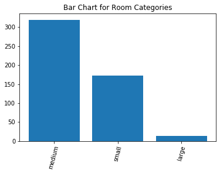


### create a new column called 'room_age' that is the sum of the room and the age columns


```python
df['room_age'] = df['RM'] + df['AGE']
```


```python
df.head()
```


<div>
<style scoped>
    .dataframe tbody tr th:only-of-type {
        vertical-align: middle;
    }

    .dataframe tbody tr th {
        vertical-align: top;
    }

    .dataframe thead th {
        text-align: right;
    }
</style>
<table border="1" class="dataframe">
  <thead>
    <tr style="text-align: right;">
      <th></th>
      <th>CRIM</th>
      <th>ZN</th>
      <th>INDUS</th>
      <th>CHAS</th>
      <th>NOX</th>
      <th>RM</th>
      <th>AGE</th>
      <th>DIS</th>
      <th>RAD</th>
      <th>TAX</th>
      <th>PTRATIO</th>
      <th>B</th>
      <th>LSTAT</th>
      <th>target</th>
      <th>room_categories</th>
      <th>room_age</th>
    </tr>
  </thead>
  <tbody>
    <tr>
      <td>0</td>
      <td>0.00632</td>
      <td>18.0</td>
      <td>2.31</td>
      <td>0.0</td>
      <td>0.538</td>
      <td>6.575</td>
      <td>65.2</td>
      <td>4.0900</td>
      <td>1.0</td>
      <td>296.0</td>
      <td>15.3</td>
      <td>396.90</td>
      <td>4.98</td>
      <td>24.0</td>
      <td>medium</td>
      <td>71.775</td>
    </tr>
    <tr>
      <td>1</td>
      <td>0.02731</td>
      <td>0.0</td>
      <td>7.07</td>
      <td>0.0</td>
      <td>0.469</td>
      <td>6.421</td>
      <td>78.9</td>
      <td>4.9671</td>
      <td>2.0</td>
      <td>242.0</td>
      <td>17.8</td>
      <td>396.90</td>
      <td>9.14</td>
      <td>21.6</td>
      <td>medium</td>
      <td>85.321</td>
    </tr>
    <tr>
      <td>2</td>
      <td>0.02729</td>
      <td>0.0</td>
      <td>7.07</td>
      <td>0.0</td>
      <td>0.469</td>
      <td>7.185</td>
      <td>61.1</td>
      <td>4.9671</td>
      <td>2.0</td>
      <td>242.0</td>
      <td>17.8</td>
      <td>392.83</td>
      <td>4.03</td>
      <td>34.7</td>
      <td>medium</td>
      <td>68.285</td>
    </tr>
    <tr>
      <td>3</td>
      <td>0.03237</td>
      <td>0.0</td>
      <td>2.18</td>
      <td>0.0</td>
      <td>0.458</td>
      <td>6.998</td>
      <td>45.8</td>
      <td>6.0622</td>
      <td>3.0</td>
      <td>222.0</td>
      <td>18.7</td>
      <td>394.63</td>
      <td>2.94</td>
      <td>33.4</td>
      <td>medium</td>
      <td>52.798</td>
    </tr>
    <tr>
      <td>4</td>
      <td>0.06905</td>
      <td>0.0</td>
      <td>2.18</td>
      <td>0.0</td>
      <td>0.458</td>
      <td>7.147</td>
      <td>54.2</td>
      <td>6.0622</td>
      <td>3.0</td>
      <td>222.0</td>
      <td>18.7</td>
      <td>396.90</td>
      <td>5.33</td>
      <td>36.2</td>
      <td>medium</td>
      <td>61.347</td>
    </tr>
  </tbody>
</table>
</div>


### let's find the statistics on the indus column


```python
df[['INDUS']].describe()
```


<div>
<style scoped>
    .dataframe tbody tr th:only-of-type {
        vertical-align: middle;
    }

    .dataframe tbody tr th {
        vertical-align: top;
    }

    .dataframe thead th {
        text-align: right;
    }
</style>
<table border="1" class="dataframe">
  <thead>
    <tr style="text-align: right;">
      <th></th>
      <th>INDUS</th>
    </tr>
  </thead>
  <tbody>
    <tr>
      <td>count</td>
      <td>506.000000</td>
    </tr>
    <tr>
      <td>mean</td>
      <td>11.136779</td>
    </tr>
    <tr>
      <td>std</td>
      <td>6.860353</td>
    </tr>
    <tr>
      <td>min</td>
      <td>0.460000</td>
    </tr>
    <tr>
      <td>25%</td>
      <td>5.190000</td>
    </tr>
    <tr>
      <td>50%</td>
      <td>9.690000</td>
    </tr>
    <tr>
      <td>75%</td>
      <td>18.100000</td>
    </tr>
    <tr>
      <td>max</td>
      <td>27.740000</td>
    </tr>
  </tbody>
</table>
</div>


### let's slice some data


```python
df["AGE"]>50
```


    0       True
    1       True
    2       True
    3      False
    4       True
           ...  
    501     True
    502     True
    503     True
    504     True
    505     True
    Name: AGE, Length: 506, dtype: bool


```python
# how do I get only ages greater than 50?
# three ways to do it, I'm going to show you two and I'm going to say which is the best to learn

# first way (not super unreliable, but not the best)
ages_50_plus_df = df[df["AGE"]>50]

ages_50_plus_df.head()
```


<div>
<style scoped>
    .dataframe tbody tr th:only-of-type {
        vertical-align: middle;
    }

    .dataframe tbody tr th {
        vertical-align: top;
    }

    .dataframe thead th {
        text-align: right;
    }
</style>
<table border="1" class="dataframe">
  <thead>
    <tr style="text-align: right;">
      <th></th>
      <th>CRIM</th>
      <th>ZN</th>
      <th>INDUS</th>
      <th>CHAS</th>
      <th>NOX</th>
      <th>RM</th>
      <th>AGE</th>
      <th>DIS</th>
      <th>RAD</th>
      <th>TAX</th>
      <th>PTRATIO</th>
      <th>B</th>
      <th>LSTAT</th>
      <th>target</th>
      <th>room_categories</th>
      <th>room_age</th>
    </tr>
  </thead>
  <tbody>
    <tr>
      <td>0</td>
      <td>0.00632</td>
      <td>18.0</td>
      <td>2.31</td>
      <td>0.0</td>
      <td>0.538</td>
      <td>6.575</td>
      <td>65.2</td>
      <td>4.0900</td>
      <td>1.0</td>
      <td>296.0</td>
      <td>15.3</td>
      <td>396.90</td>
      <td>4.98</td>
      <td>24.0</td>
      <td>medium</td>
      <td>71.775</td>
    </tr>
    <tr>
      <td>1</td>
      <td>0.02731</td>
      <td>0.0</td>
      <td>7.07</td>
      <td>0.0</td>
      <td>0.469</td>
      <td>6.421</td>
      <td>78.9</td>
      <td>4.9671</td>
      <td>2.0</td>
      <td>242.0</td>
      <td>17.8</td>
      <td>396.90</td>
      <td>9.14</td>
      <td>21.6</td>
      <td>medium</td>
      <td>85.321</td>
    </tr>
    <tr>
      <td>2</td>
      <td>0.02729</td>
      <td>0.0</td>
      <td>7.07</td>
      <td>0.0</td>
      <td>0.469</td>
      <td>7.185</td>
      <td>61.1</td>
      <td>4.9671</td>
      <td>2.0</td>
      <td>242.0</td>
      <td>17.8</td>
      <td>392.83</td>
      <td>4.03</td>
      <td>34.7</td>
      <td>medium</td>
      <td>68.285</td>
    </tr>
    <tr>
      <td>4</td>
      <td>0.06905</td>
      <td>0.0</td>
      <td>2.18</td>
      <td>0.0</td>
      <td>0.458</td>
      <td>7.147</td>
      <td>54.2</td>
      <td>6.0622</td>
      <td>3.0</td>
      <td>222.0</td>
      <td>18.7</td>
      <td>396.90</td>
      <td>5.33</td>
      <td>36.2</td>
      <td>medium</td>
      <td>61.347</td>
    </tr>
    <tr>
      <td>5</td>
      <td>0.02985</td>
      <td>0.0</td>
      <td>2.18</td>
      <td>0.0</td>
      <td>0.458</td>
      <td>6.430</td>
      <td>58.7</td>
      <td>6.0622</td>
      <td>3.0</td>
      <td>222.0</td>
      <td>18.7</td>
      <td>394.12</td>
      <td>5.21</td>
      <td>28.7</td>
      <td>medium</td>
      <td>65.130</td>
    </tr>
  </tbody>
</table>
</div>


```python
# second way which is way better and scalable
ages_50_plus_df = df.loc[df["AGE"]>50]
ages_50_plus_df
```


<div>
<style scoped>
    .dataframe tbody tr th:only-of-type {
        vertical-align: middle;
    }

    .dataframe tbody tr th {
        vertical-align: top;
    }

    .dataframe thead th {
        text-align: right;
    }
</style>
<table border="1" class="dataframe">
  <thead>
    <tr style="text-align: right;">
      <th></th>
      <th>CRIM</th>
      <th>ZN</th>
      <th>INDUS</th>
      <th>CHAS</th>
      <th>NOX</th>
      <th>RM</th>
      <th>AGE</th>
      <th>DIS</th>
      <th>RAD</th>
      <th>TAX</th>
      <th>PTRATIO</th>
      <th>B</th>
      <th>LSTAT</th>
      <th>target</th>
      <th>room_categories</th>
      <th>room_age</th>
    </tr>
  </thead>
  <tbody>
    <tr>
      <td>0</td>
      <td>0.00632</td>
      <td>18.0</td>
      <td>2.31</td>
      <td>0.0</td>
      <td>0.538</td>
      <td>6.575</td>
      <td>65.2</td>
      <td>4.0900</td>
      <td>1.0</td>
      <td>296.0</td>
      <td>15.3</td>
      <td>396.90</td>
      <td>4.98</td>
      <td>24.0</td>
      <td>medium</td>
      <td>71.775</td>
    </tr>
    <tr>
      <td>1</td>
      <td>0.02731</td>
      <td>0.0</td>
      <td>7.07</td>
      <td>0.0</td>
      <td>0.469</td>
      <td>6.421</td>
      <td>78.9</td>
      <td>4.9671</td>
      <td>2.0</td>
      <td>242.0</td>
      <td>17.8</td>
      <td>396.90</td>
      <td>9.14</td>
      <td>21.6</td>
      <td>medium</td>
      <td>85.321</td>
    </tr>
    <tr>
      <td>2</td>
      <td>0.02729</td>
      <td>0.0</td>
      <td>7.07</td>
      <td>0.0</td>
      <td>0.469</td>
      <td>7.185</td>
      <td>61.1</td>
      <td>4.9671</td>
      <td>2.0</td>
      <td>242.0</td>
      <td>17.8</td>
      <td>392.83</td>
      <td>4.03</td>
      <td>34.7</td>
      <td>medium</td>
      <td>68.285</td>
    </tr>
    <tr>
      <td>4</td>
      <td>0.06905</td>
      <td>0.0</td>
      <td>2.18</td>
      <td>0.0</td>
      <td>0.458</td>
      <td>7.147</td>
      <td>54.2</td>
      <td>6.0622</td>
      <td>3.0</td>
      <td>222.0</td>
      <td>18.7</td>
      <td>396.90</td>
      <td>5.33</td>
      <td>36.2</td>
      <td>medium</td>
      <td>61.347</td>
    </tr>
    <tr>
      <td>5</td>
      <td>0.02985</td>
      <td>0.0</td>
      <td>2.18</td>
      <td>0.0</td>
      <td>0.458</td>
      <td>6.430</td>
      <td>58.7</td>
      <td>6.0622</td>
      <td>3.0</td>
      <td>222.0</td>
      <td>18.7</td>
      <td>394.12</td>
      <td>5.21</td>
      <td>28.7</td>
      <td>medium</td>
      <td>65.130</td>
    </tr>
    <tr>
      <td>...</td>
      <td>...</td>
      <td>...</td>
      <td>...</td>
      <td>...</td>
      <td>...</td>
      <td>...</td>
      <td>...</td>
      <td>...</td>
      <td>...</td>
      <td>...</td>
      <td>...</td>
      <td>...</td>
      <td>...</td>
      <td>...</td>
      <td>...</td>
      <td>...</td>
    </tr>
    <tr>
      <td>501</td>
      <td>0.06263</td>
      <td>0.0</td>
      <td>11.93</td>
      <td>0.0</td>
      <td>0.573</td>
      <td>6.593</td>
      <td>69.1</td>
      <td>2.4786</td>
      <td>1.0</td>
      <td>273.0</td>
      <td>21.0</td>
      <td>391.99</td>
      <td>9.67</td>
      <td>22.4</td>
      <td>medium</td>
      <td>75.693</td>
    </tr>
    <tr>
      <td>502</td>
      <td>0.04527</td>
      <td>0.0</td>
      <td>11.93</td>
      <td>0.0</td>
      <td>0.573</td>
      <td>6.120</td>
      <td>76.7</td>
      <td>2.2875</td>
      <td>1.0</td>
      <td>273.0</td>
      <td>21.0</td>
      <td>396.90</td>
      <td>9.08</td>
      <td>20.6</td>
      <td>medium</td>
      <td>82.820</td>
    </tr>
    <tr>
      <td>503</td>
      <td>0.06076</td>
      <td>0.0</td>
      <td>11.93</td>
      <td>0.0</td>
      <td>0.573</td>
      <td>6.976</td>
      <td>91.0</td>
      <td>2.1675</td>
      <td>1.0</td>
      <td>273.0</td>
      <td>21.0</td>
      <td>396.90</td>
      <td>5.64</td>
      <td>23.9</td>
      <td>medium</td>
      <td>97.976</td>
    </tr>
    <tr>
      <td>504</td>
      <td>0.10959</td>
      <td>0.0</td>
      <td>11.93</td>
      <td>0.0</td>
      <td>0.573</td>
      <td>6.794</td>
      <td>89.3</td>
      <td>2.3889</td>
      <td>1.0</td>
      <td>273.0</td>
      <td>21.0</td>
      <td>393.45</td>
      <td>6.48</td>
      <td>22.0</td>
      <td>medium</td>
      <td>96.094</td>
    </tr>
    <tr>
      <td>505</td>
      <td>0.04741</td>
      <td>0.0</td>
      <td>11.93</td>
      <td>0.0</td>
      <td>0.573</td>
      <td>6.030</td>
      <td>80.8</td>
      <td>2.5050</td>
      <td>1.0</td>
      <td>273.0</td>
      <td>21.0</td>
      <td>396.90</td>
      <td>7.88</td>
      <td>11.9</td>
      <td>medium</td>
      <td>86.830</td>
    </tr>
  </tbody>
</table>
<p>359 rows × 16 columns</p>
</div>


```python
# now let's make a dataframe with ages greater than 50 and rooms greater than 6
df.loc[(df["AGE"]>50) & (df["RM"] > 6) ]
```


<div>
<style scoped>
    .dataframe tbody tr th:only-of-type {
        vertical-align: middle;
    }

    .dataframe tbody tr th {
        vertical-align: top;
    }

    .dataframe thead th {
        text-align: right;
    }
</style>
<table border="1" class="dataframe">
  <thead>
    <tr style="text-align: right;">
      <th></th>
      <th>CRIM</th>
      <th>ZN</th>
      <th>INDUS</th>
      <th>CHAS</th>
      <th>NOX</th>
      <th>RM</th>
      <th>AGE</th>
      <th>DIS</th>
      <th>RAD</th>
      <th>TAX</th>
      <th>PTRATIO</th>
      <th>B</th>
      <th>LSTAT</th>
      <th>target</th>
      <th>room_categories</th>
      <th>room_age</th>
    </tr>
  </thead>
  <tbody>
    <tr>
      <td>0</td>
      <td>0.00632</td>
      <td>18.0</td>
      <td>2.31</td>
      <td>0.0</td>
      <td>0.538</td>
      <td>6.575</td>
      <td>65.2</td>
      <td>4.0900</td>
      <td>1.0</td>
      <td>296.0</td>
      <td>15.3</td>
      <td>396.90</td>
      <td>4.98</td>
      <td>24.0</td>
      <td>medium</td>
      <td>71.775</td>
    </tr>
    <tr>
      <td>1</td>
      <td>0.02731</td>
      <td>0.0</td>
      <td>7.07</td>
      <td>0.0</td>
      <td>0.469</td>
      <td>6.421</td>
      <td>78.9</td>
      <td>4.9671</td>
      <td>2.0</td>
      <td>242.0</td>
      <td>17.8</td>
      <td>396.90</td>
      <td>9.14</td>
      <td>21.6</td>
      <td>medium</td>
      <td>85.321</td>
    </tr>
    <tr>
      <td>2</td>
      <td>0.02729</td>
      <td>0.0</td>
      <td>7.07</td>
      <td>0.0</td>
      <td>0.469</td>
      <td>7.185</td>
      <td>61.1</td>
      <td>4.9671</td>
      <td>2.0</td>
      <td>242.0</td>
      <td>17.8</td>
      <td>392.83</td>
      <td>4.03</td>
      <td>34.7</td>
      <td>medium</td>
      <td>68.285</td>
    </tr>
    <tr>
      <td>4</td>
      <td>0.06905</td>
      <td>0.0</td>
      <td>2.18</td>
      <td>0.0</td>
      <td>0.458</td>
      <td>7.147</td>
      <td>54.2</td>
      <td>6.0622</td>
      <td>3.0</td>
      <td>222.0</td>
      <td>18.7</td>
      <td>396.90</td>
      <td>5.33</td>
      <td>36.2</td>
      <td>medium</td>
      <td>61.347</td>
    </tr>
    <tr>
      <td>5</td>
      <td>0.02985</td>
      <td>0.0</td>
      <td>2.18</td>
      <td>0.0</td>
      <td>0.458</td>
      <td>6.430</td>
      <td>58.7</td>
      <td>6.0622</td>
      <td>3.0</td>
      <td>222.0</td>
      <td>18.7</td>
      <td>394.12</td>
      <td>5.21</td>
      <td>28.7</td>
      <td>medium</td>
      <td>65.130</td>
    </tr>
    <tr>
      <td>...</td>
      <td>...</td>
      <td>...</td>
      <td>...</td>
      <td>...</td>
      <td>...</td>
      <td>...</td>
      <td>...</td>
      <td>...</td>
      <td>...</td>
      <td>...</td>
      <td>...</td>
      <td>...</td>
      <td>...</td>
      <td>...</td>
      <td>...</td>
      <td>...</td>
    </tr>
    <tr>
      <td>501</td>
      <td>0.06263</td>
      <td>0.0</td>
      <td>11.93</td>
      <td>0.0</td>
      <td>0.573</td>
      <td>6.593</td>
      <td>69.1</td>
      <td>2.4786</td>
      <td>1.0</td>
      <td>273.0</td>
      <td>21.0</td>
      <td>391.99</td>
      <td>9.67</td>
      <td>22.4</td>
      <td>medium</td>
      <td>75.693</td>
    </tr>
    <tr>
      <td>502</td>
      <td>0.04527</td>
      <td>0.0</td>
      <td>11.93</td>
      <td>0.0</td>
      <td>0.573</td>
      <td>6.120</td>
      <td>76.7</td>
      <td>2.2875</td>
      <td>1.0</td>
      <td>273.0</td>
      <td>21.0</td>
      <td>396.90</td>
      <td>9.08</td>
      <td>20.6</td>
      <td>medium</td>
      <td>82.820</td>
    </tr>
    <tr>
      <td>503</td>
      <td>0.06076</td>
      <td>0.0</td>
      <td>11.93</td>
      <td>0.0</td>
      <td>0.573</td>
      <td>6.976</td>
      <td>91.0</td>
      <td>2.1675</td>
      <td>1.0</td>
      <td>273.0</td>
      <td>21.0</td>
      <td>396.90</td>
      <td>5.64</td>
      <td>23.9</td>
      <td>medium</td>
      <td>97.976</td>
    </tr>
    <tr>
      <td>504</td>
      <td>0.10959</td>
      <td>0.0</td>
      <td>11.93</td>
      <td>0.0</td>
      <td>0.573</td>
      <td>6.794</td>
      <td>89.3</td>
      <td>2.3889</td>
      <td>1.0</td>
      <td>273.0</td>
      <td>21.0</td>
      <td>393.45</td>
      <td>6.48</td>
      <td>22.0</td>
      <td>medium</td>
      <td>96.094</td>
    </tr>
    <tr>
      <td>505</td>
      <td>0.04741</td>
      <td>0.0</td>
      <td>11.93</td>
      <td>0.0</td>
      <td>0.573</td>
      <td>6.030</td>
      <td>80.8</td>
      <td>2.5050</td>
      <td>1.0</td>
      <td>273.0</td>
      <td>21.0</td>
      <td>396.90</td>
      <td>7.88</td>
      <td>11.9</td>
      <td>medium</td>
      <td>86.830</td>
    </tr>
  </tbody>
</table>
<p>220 rows × 16 columns</p>
</div>


```python
# now let's make a dataframe with ages greater than 50 or rooms greater than 6
df_new = df.loc[(df["AGE"]>50) | (df["RM"] > 6) ]
df_new.head()
```


<div>
<style scoped>
    .dataframe tbody tr th:only-of-type {
        vertical-align: middle;
    }

    .dataframe tbody tr th {
        vertical-align: top;
    }

    .dataframe thead th {
        text-align: right;
    }
</style>
<table border="1" class="dataframe">
  <thead>
    <tr style="text-align: right;">
      <th></th>
      <th>CRIM</th>
      <th>ZN</th>
      <th>INDUS</th>
      <th>CHAS</th>
      <th>NOX</th>
      <th>RM</th>
      <th>AGE</th>
      <th>DIS</th>
      <th>RAD</th>
      <th>TAX</th>
      <th>PTRATIO</th>
      <th>B</th>
      <th>LSTAT</th>
      <th>target</th>
      <th>room_categories</th>
      <th>room_age</th>
    </tr>
  </thead>
  <tbody>
    <tr>
      <td>0</td>
      <td>0.00632</td>
      <td>18.0</td>
      <td>2.31</td>
      <td>0.0</td>
      <td>0.538</td>
      <td>6.575</td>
      <td>65.2</td>
      <td>4.0900</td>
      <td>1.0</td>
      <td>296.0</td>
      <td>15.3</td>
      <td>396.90</td>
      <td>4.98</td>
      <td>24.0</td>
      <td>medium</td>
      <td>71.775</td>
    </tr>
    <tr>
      <td>1</td>
      <td>0.02731</td>
      <td>0.0</td>
      <td>7.07</td>
      <td>0.0</td>
      <td>0.469</td>
      <td>6.421</td>
      <td>78.9</td>
      <td>4.9671</td>
      <td>2.0</td>
      <td>242.0</td>
      <td>17.8</td>
      <td>396.90</td>
      <td>9.14</td>
      <td>21.6</td>
      <td>medium</td>
      <td>85.321</td>
    </tr>
    <tr>
      <td>2</td>
      <td>0.02729</td>
      <td>0.0</td>
      <td>7.07</td>
      <td>0.0</td>
      <td>0.469</td>
      <td>7.185</td>
      <td>61.1</td>
      <td>4.9671</td>
      <td>2.0</td>
      <td>242.0</td>
      <td>17.8</td>
      <td>392.83</td>
      <td>4.03</td>
      <td>34.7</td>
      <td>medium</td>
      <td>68.285</td>
    </tr>
    <tr>
      <td>3</td>
      <td>0.03237</td>
      <td>0.0</td>
      <td>2.18</td>
      <td>0.0</td>
      <td>0.458</td>
      <td>6.998</td>
      <td>45.8</td>
      <td>6.0622</td>
      <td>3.0</td>
      <td>222.0</td>
      <td>18.7</td>
      <td>394.63</td>
      <td>2.94</td>
      <td>33.4</td>
      <td>medium</td>
      <td>52.798</td>
    </tr>
    <tr>
      <td>4</td>
      <td>0.06905</td>
      <td>0.0</td>
      <td>2.18</td>
      <td>0.0</td>
      <td>0.458</td>
      <td>7.147</td>
      <td>54.2</td>
      <td>6.0622</td>
      <td>3.0</td>
      <td>222.0</td>
      <td>18.7</td>
      <td>396.90</td>
      <td>5.33</td>
      <td>36.2</td>
      <td>medium</td>
      <td>61.347</td>
    </tr>
  </tbody>
</table>
</div>


```python
df_new[["INDUS", "CHAS", "RAD"]]
```


<div>
<style scoped>
    .dataframe tbody tr th:only-of-type {
        vertical-align: middle;
    }

    .dataframe tbody tr th {
        vertical-align: top;
    }

    .dataframe thead th {
        text-align: right;
    }
</style>
<table border="1" class="dataframe">
  <thead>
    <tr style="text-align: right;">
      <th></th>
      <th>INDUS</th>
      <th>CHAS</th>
      <th>RAD</th>
    </tr>
  </thead>
  <tbody>
    <tr>
      <td>0</td>
      <td>2.31</td>
      <td>0.0</td>
      <td>1.0</td>
    </tr>
    <tr>
      <td>1</td>
      <td>7.07</td>
      <td>0.0</td>
      <td>2.0</td>
    </tr>
    <tr>
      <td>2</td>
      <td>7.07</td>
      <td>0.0</td>
      <td>2.0</td>
    </tr>
    <tr>
      <td>3</td>
      <td>2.18</td>
      <td>0.0</td>
      <td>3.0</td>
    </tr>
    <tr>
      <td>4</td>
      <td>2.18</td>
      <td>0.0</td>
      <td>3.0</td>
    </tr>
    <tr>
      <td>...</td>
      <td>...</td>
      <td>...</td>
      <td>...</td>
    </tr>
    <tr>
      <td>501</td>
      <td>11.93</td>
      <td>0.0</td>
      <td>1.0</td>
    </tr>
    <tr>
      <td>502</td>
      <td>11.93</td>
      <td>0.0</td>
      <td>1.0</td>
    </tr>
    <tr>
      <td>503</td>
      <td>11.93</td>
      <td>0.0</td>
      <td>1.0</td>
    </tr>
    <tr>
      <td>504</td>
      <td>11.93</td>
      <td>0.0</td>
      <td>1.0</td>
    </tr>
    <tr>
      <td>505</td>
      <td>11.93</td>
      <td>0.0</td>
      <td>1.0</td>
    </tr>
  </tbody>
</table>
<p>472 rows × 3 columns</p>
</div>


```python
# now let's make a dataframe with ages greater than 50 or rooms greater than 6 and let's only grab 
# the CRIM and LSTAT columns

df.loc[(df["AGE"]>50) | (df["RM"] > 6)][["CRIM", "LSTAT"]] # THIS ISN'T PREFERRED
```


<div>
<style scoped>
    .dataframe tbody tr th:only-of-type {
        vertical-align: middle;
    }

    .dataframe tbody tr th {
        vertical-align: top;
    }

    .dataframe thead th {
        text-align: right;
    }
</style>
<table border="1" class="dataframe">
  <thead>
    <tr style="text-align: right;">
      <th></th>
      <th>CRIM</th>
      <th>LSTAT</th>
    </tr>
  </thead>
  <tbody>
    <tr>
      <td>0</td>
      <td>0.00632</td>
      <td>4.98</td>
    </tr>
    <tr>
      <td>1</td>
      <td>0.02731</td>
      <td>9.14</td>
    </tr>
    <tr>
      <td>2</td>
      <td>0.02729</td>
      <td>4.03</td>
    </tr>
    <tr>
      <td>3</td>
      <td>0.03237</td>
      <td>2.94</td>
    </tr>
    <tr>
      <td>4</td>
      <td>0.06905</td>
      <td>5.33</td>
    </tr>
    <tr>
      <td>...</td>
      <td>...</td>
      <td>...</td>
    </tr>
    <tr>
      <td>501</td>
      <td>0.06263</td>
      <td>9.67</td>
    </tr>
    <tr>
      <td>502</td>
      <td>0.04527</td>
      <td>9.08</td>
    </tr>
    <tr>
      <td>503</td>
      <td>0.06076</td>
      <td>5.64</td>
    </tr>
    <tr>
      <td>504</td>
      <td>0.10959</td>
      <td>6.48</td>
    </tr>
    <tr>
      <td>505</td>
      <td>0.04741</td>
      <td>7.88</td>
    </tr>
  </tbody>
</table>
<p>472 rows × 2 columns</p>
</div>


```python
df.loc[(df["AGE"]>50) | (df["RM"] > 6), ['CRIM', 'LSTAT']]  # THIS IS THE PREFERRED WAY, USING LOC
```


<div>
<style scoped>
    .dataframe tbody tr th:only-of-type {
        vertical-align: middle;
    }

    .dataframe tbody tr th {
        vertical-align: top;
    }

    .dataframe thead th {
        text-align: right;
    }
</style>
<table border="1" class="dataframe">
  <thead>
    <tr style="text-align: right;">
      <th></th>
      <th>CRIM</th>
      <th>LSTAT</th>
    </tr>
  </thead>
  <tbody>
    <tr>
      <td>0</td>
      <td>0.00632</td>
      <td>4.98</td>
    </tr>
    <tr>
      <td>1</td>
      <td>0.02731</td>
      <td>9.14</td>
    </tr>
    <tr>
      <td>2</td>
      <td>0.02729</td>
      <td>4.03</td>
    </tr>
    <tr>
      <td>3</td>
      <td>0.03237</td>
      <td>2.94</td>
    </tr>
    <tr>
      <td>4</td>
      <td>0.06905</td>
      <td>5.33</td>
    </tr>
    <tr>
      <td>...</td>
      <td>...</td>
      <td>...</td>
    </tr>
    <tr>
      <td>501</td>
      <td>0.06263</td>
      <td>9.67</td>
    </tr>
    <tr>
      <td>502</td>
      <td>0.04527</td>
      <td>9.08</td>
    </tr>
    <tr>
      <td>503</td>
      <td>0.06076</td>
      <td>5.64</td>
    </tr>
    <tr>
      <td>504</td>
      <td>0.10959</td>
      <td>6.48</td>
    </tr>
    <tr>
      <td>505</td>
      <td>0.04741</td>
      <td>7.88</td>
    </tr>
  </tbody>
</table>
<p>472 rows × 2 columns</p>
</div>


```python

```


```python

```


```python
plt.figure(figsize=(5, 5))
plt.bar()
```


    ---------------------------------------------------------------------------

    TypeError                                 Traceback (most recent call last)

    <ipython-input-26-7d78820f768d> in <module>
    ----> 1 df["room_categories"].plot(kind='bar')
    

    ~/anaconda3/envs/flatiron-env/lib/python3.6/site-packages/pandas/plotting/_core.py in __call__(self, *args, **kwargs)
        792                     data.columns = label_name
        793 
    --> 794         return plot_backend.plot(data, kind=kind, **kwargs)
        795 
        796     def line(self, x=None, y=None, **kwargs):


    ~/anaconda3/envs/flatiron-env/lib/python3.6/site-packages/pandas/plotting/_matplotlib/__init__.py in plot(data, kind, **kwargs)
         60             kwargs["ax"] = getattr(ax, "left_ax", ax)
         61     plot_obj = PLOT_CLASSES[kind](data, **kwargs)
    ---> 62     plot_obj.generate()
         63     plot_obj.draw()
         64     return plot_obj.result


    ~/anaconda3/envs/flatiron-env/lib/python3.6/site-packages/pandas/plotting/_matplotlib/core.py in generate(self)
        277     def generate(self):
        278         self._args_adjust()
    --> 279         self._compute_plot_data()
        280         self._setup_subplots()
        281         self._make_plot()


    ~/anaconda3/envs/flatiron-env/lib/python3.6/site-packages/pandas/plotting/_matplotlib/core.py in _compute_plot_data(self)
        412         # no non-numeric frames or series allowed
        413         if is_empty:
    --> 414             raise TypeError("no numeric data to plot")
        415 
        416         # GH25587: cast ExtensionArray of pandas (IntegerArray, etc.) to


    TypeError: no numeric data to plot


```python

```


```python

```


```python
# pandas slicing
# get dataframe with rows where target < 30

# method 1
# df[df["target"] < 30]


# method 2
# df.loc[df["target"] < 30]
```


```python
df[["AGE", "ZN"]]
```


<div>
<style scoped>
    .dataframe tbody tr th:only-of-type {
        vertical-align: middle;
    }

    .dataframe tbody tr th {
        vertical-align: top;
    }

    .dataframe thead th {
        text-align: right;
    }
</style>
<table border="1" class="dataframe">
  <thead>
    <tr style="text-align: right;">
      <th></th>
      <th>AGE</th>
      <th>ZN</th>
    </tr>
  </thead>
  <tbody>
    <tr>
      <td>0</td>
      <td>65.2</td>
      <td>18.0</td>
    </tr>
    <tr>
      <td>1</td>
      <td>78.9</td>
      <td>0.0</td>
    </tr>
    <tr>
      <td>2</td>
      <td>61.1</td>
      <td>0.0</td>
    </tr>
    <tr>
      <td>3</td>
      <td>45.8</td>
      <td>0.0</td>
    </tr>
    <tr>
      <td>4</td>
      <td>54.2</td>
      <td>0.0</td>
    </tr>
    <tr>
      <td>...</td>
      <td>...</td>
      <td>...</td>
    </tr>
    <tr>
      <td>501</td>
      <td>69.1</td>
      <td>0.0</td>
    </tr>
    <tr>
      <td>502</td>
      <td>76.7</td>
      <td>0.0</td>
    </tr>
    <tr>
      <td>503</td>
      <td>91.0</td>
      <td>0.0</td>
    </tr>
    <tr>
      <td>504</td>
      <td>89.3</td>
      <td>0.0</td>
    </tr>
    <tr>
      <td>505</td>
      <td>80.8</td>
      <td>0.0</td>
    </tr>
  </tbody>
</table>
<p>506 rows × 2 columns</p>
</div>


```python
# pandas slicing
# get dataframe with rows where target < 30 but only grab the AGE and ZN columns

# method 1
# df[df["target"] < 30][["AGE", "ZN"]]


# method 2
# df.loc[df["target"] < 30, ["AGE", "ZN"]]
```


<div>
<style scoped>
    .dataframe tbody tr th:only-of-type {
        vertical-align: middle;
    }

    .dataframe tbody tr th {
        vertical-align: top;
    }

    .dataframe thead th {
        text-align: right;
    }
</style>
<table border="1" class="dataframe">
  <thead>
    <tr style="text-align: right;">
      <th></th>
      <th>AGE</th>
      <th>ZN</th>
    </tr>
  </thead>
  <tbody>
    <tr>
      <td>0</td>
      <td>65.2</td>
      <td>18.0</td>
    </tr>
    <tr>
      <td>1</td>
      <td>78.9</td>
      <td>0.0</td>
    </tr>
    <tr>
      <td>5</td>
      <td>58.7</td>
      <td>0.0</td>
    </tr>
    <tr>
      <td>6</td>
      <td>66.6</td>
      <td>12.5</td>
    </tr>
    <tr>
      <td>7</td>
      <td>96.1</td>
      <td>12.5</td>
    </tr>
    <tr>
      <td>...</td>
      <td>...</td>
      <td>...</td>
    </tr>
    <tr>
      <td>501</td>
      <td>69.1</td>
      <td>0.0</td>
    </tr>
    <tr>
      <td>502</td>
      <td>76.7</td>
      <td>0.0</td>
    </tr>
    <tr>
      <td>503</td>
      <td>91.0</td>
      <td>0.0</td>
    </tr>
    <tr>
      <td>504</td>
      <td>89.3</td>
      <td>0.0</td>
    </tr>
    <tr>
      <td>505</td>
      <td>80.8</td>
      <td>0.0</td>
    </tr>
  </tbody>
</table>
<p>422 rows × 2 columns</p>
</div>


```python
# pandas slicing on multiple conditions
# target < 30 and age > 80

# method 1
# df[(df["target"]<30) & (df["AGE"] > 80)]

# method 2
df.loc[(df["target"]<30) & (df["AGE"]>80)]

```


<div>
<style scoped>
    .dataframe tbody tr th:only-of-type {
        vertical-align: middle;
    }

    .dataframe tbody tr th {
        vertical-align: top;
    }

    .dataframe thead th {
        text-align: right;
    }
</style>
<table border="1" class="dataframe">
  <thead>
    <tr style="text-align: right;">
      <th></th>
      <th>CRIM</th>
      <th>ZN</th>
      <th>INDUS</th>
      <th>CHAS</th>
      <th>NOX</th>
      <th>RM</th>
      <th>AGE</th>
      <th>DIS</th>
      <th>RAD</th>
      <th>TAX</th>
      <th>PTRATIO</th>
      <th>B</th>
      <th>LSTAT</th>
      <th>target</th>
    </tr>
  </thead>
  <tbody>
    <tr>
      <td>7</td>
      <td>0.14455</td>
      <td>12.5</td>
      <td>7.87</td>
      <td>0.0</td>
      <td>0.524</td>
      <td>6.172</td>
      <td>96.1</td>
      <td>5.9505</td>
      <td>5.0</td>
      <td>311.0</td>
      <td>15.2</td>
      <td>396.90</td>
      <td>19.15</td>
      <td>27.1</td>
    </tr>
    <tr>
      <td>8</td>
      <td>0.21124</td>
      <td>12.5</td>
      <td>7.87</td>
      <td>0.0</td>
      <td>0.524</td>
      <td>5.631</td>
      <td>100.0</td>
      <td>6.0821</td>
      <td>5.0</td>
      <td>311.0</td>
      <td>15.2</td>
      <td>386.63</td>
      <td>29.93</td>
      <td>16.5</td>
    </tr>
    <tr>
      <td>9</td>
      <td>0.17004</td>
      <td>12.5</td>
      <td>7.87</td>
      <td>0.0</td>
      <td>0.524</td>
      <td>6.004</td>
      <td>85.9</td>
      <td>6.5921</td>
      <td>5.0</td>
      <td>311.0</td>
      <td>15.2</td>
      <td>386.71</td>
      <td>17.10</td>
      <td>18.9</td>
    </tr>
    <tr>
      <td>10</td>
      <td>0.22489</td>
      <td>12.5</td>
      <td>7.87</td>
      <td>0.0</td>
      <td>0.524</td>
      <td>6.377</td>
      <td>94.3</td>
      <td>6.3467</td>
      <td>5.0</td>
      <td>311.0</td>
      <td>15.2</td>
      <td>392.52</td>
      <td>20.45</td>
      <td>15.0</td>
    </tr>
    <tr>
      <td>11</td>
      <td>0.11747</td>
      <td>12.5</td>
      <td>7.87</td>
      <td>0.0</td>
      <td>0.524</td>
      <td>6.009</td>
      <td>82.9</td>
      <td>6.2267</td>
      <td>5.0</td>
      <td>311.0</td>
      <td>15.2</td>
      <td>396.90</td>
      <td>13.27</td>
      <td>18.9</td>
    </tr>
    <tr>
      <td>...</td>
      <td>...</td>
      <td>...</td>
      <td>...</td>
      <td>...</td>
      <td>...</td>
      <td>...</td>
      <td>...</td>
      <td>...</td>
      <td>...</td>
      <td>...</td>
      <td>...</td>
      <td>...</td>
      <td>...</td>
      <td>...</td>
    </tr>
    <tr>
      <td>491</td>
      <td>0.10574</td>
      <td>0.0</td>
      <td>27.74</td>
      <td>0.0</td>
      <td>0.609</td>
      <td>5.983</td>
      <td>98.8</td>
      <td>1.8681</td>
      <td>4.0</td>
      <td>711.0</td>
      <td>20.1</td>
      <td>390.11</td>
      <td>18.07</td>
      <td>13.6</td>
    </tr>
    <tr>
      <td>492</td>
      <td>0.11132</td>
      <td>0.0</td>
      <td>27.74</td>
      <td>0.0</td>
      <td>0.609</td>
      <td>5.983</td>
      <td>83.5</td>
      <td>2.1099</td>
      <td>4.0</td>
      <td>711.0</td>
      <td>20.1</td>
      <td>396.90</td>
      <td>13.35</td>
      <td>20.1</td>
    </tr>
    <tr>
      <td>503</td>
      <td>0.06076</td>
      <td>0.0</td>
      <td>11.93</td>
      <td>0.0</td>
      <td>0.573</td>
      <td>6.976</td>
      <td>91.0</td>
      <td>2.1675</td>
      <td>1.0</td>
      <td>273.0</td>
      <td>21.0</td>
      <td>396.90</td>
      <td>5.64</td>
      <td>23.9</td>
    </tr>
    <tr>
      <td>504</td>
      <td>0.10959</td>
      <td>0.0</td>
      <td>11.93</td>
      <td>0.0</td>
      <td>0.573</td>
      <td>6.794</td>
      <td>89.3</td>
      <td>2.3889</td>
      <td>1.0</td>
      <td>273.0</td>
      <td>21.0</td>
      <td>393.45</td>
      <td>6.48</td>
      <td>22.0</td>
    </tr>
    <tr>
      <td>505</td>
      <td>0.04741</td>
      <td>0.0</td>
      <td>11.93</td>
      <td>0.0</td>
      <td>0.573</td>
      <td>6.030</td>
      <td>80.8</td>
      <td>2.5050</td>
      <td>1.0</td>
      <td>273.0</td>
      <td>21.0</td>
      <td>396.90</td>
      <td>7.88</td>
      <td>11.9</td>
    </tr>
  </tbody>
</table>
<p>215 rows × 14 columns</p>
</div>


```python
# pandas slicing on mult. conditions for specific columns
# target > 30 and age > 75 but only grab the target and age columns


# method 1
# df[(df["target"] > 30) & (df["AGE"] > 75)][["target", "AGE"]]

# method 2
# df.loc[(df["target"] > 30) & (df["AGE"] > 75), ["target", "AGE"]]

# method 3
# df[["AGE", "target"]][(df["target"]>30) & (df["AGE"]>75)]
```


```python
# pandas slicing on mult. conditions for specific columns
# target > 30 and age > 75 but only grab the CRIM


df.loc[(df["target"]>30) & (df["AGE"]>75), ["CRIM"]]
```


<div>
<style scoped>
    .dataframe tbody tr th:only-of-type {
        vertical-align: middle;
    }

    .dataframe tbody tr th {
        vertical-align: top;
    }

    .dataframe thead th {
        text-align: right;
    }
</style>
<table border="1" class="dataframe">
  <thead>
    <tr style="text-align: right;">
      <th></th>
      <th>CRIM</th>
    </tr>
  </thead>
  <tbody>
    <tr>
      <td>97</td>
      <td>0.12083</td>
    </tr>
    <tr>
      <td>157</td>
      <td>1.22358</td>
    </tr>
    <tr>
      <td>161</td>
      <td>1.46336</td>
    </tr>
    <tr>
      <td>162</td>
      <td>1.83377</td>
    </tr>
    <tr>
      <td>163</td>
      <td>1.51902</td>
    </tr>
    <tr>
      <td>166</td>
      <td>2.01019</td>
    </tr>
    <tr>
      <td>180</td>
      <td>0.06588</td>
    </tr>
    <tr>
      <td>182</td>
      <td>0.09103</td>
    </tr>
    <tr>
      <td>183</td>
      <td>0.10008</td>
    </tr>
    <tr>
      <td>223</td>
      <td>0.61470</td>
    </tr>
    <tr>
      <td>224</td>
      <td>0.31533</td>
    </tr>
    <tr>
      <td>225</td>
      <td>0.52693</td>
    </tr>
    <tr>
      <td>226</td>
      <td>0.38214</td>
    </tr>
    <tr>
      <td>227</td>
      <td>0.41238</td>
    </tr>
    <tr>
      <td>231</td>
      <td>0.46296</td>
    </tr>
    <tr>
      <td>257</td>
      <td>0.61154</td>
    </tr>
    <tr>
      <td>258</td>
      <td>0.66351</td>
    </tr>
    <tr>
      <td>259</td>
      <td>0.65665</td>
    </tr>
    <tr>
      <td>260</td>
      <td>0.54011</td>
    </tr>
    <tr>
      <td>261</td>
      <td>0.53412</td>
    </tr>
    <tr>
      <td>262</td>
      <td>0.52014</td>
    </tr>
    <tr>
      <td>263</td>
      <td>0.82526</td>
    </tr>
    <tr>
      <td>264</td>
      <td>0.55007</td>
    </tr>
    <tr>
      <td>266</td>
      <td>0.78570</td>
    </tr>
    <tr>
      <td>368</td>
      <td>4.89822</td>
    </tr>
    <tr>
      <td>369</td>
      <td>5.66998</td>
    </tr>
    <tr>
      <td>370</td>
      <td>6.53876</td>
    </tr>
    <tr>
      <td>371</td>
      <td>9.23230</td>
    </tr>
    <tr>
      <td>372</td>
      <td>8.26725</td>
    </tr>
  </tbody>
</table>
</div>


```python
# Plot a scattermatrix of your dataframe

pd.plotting.scatter_matrix(df, figsize=(20, 20), grid=True, hist_kwds={"bins": 20, "color":"purple"})
plt.show()
```


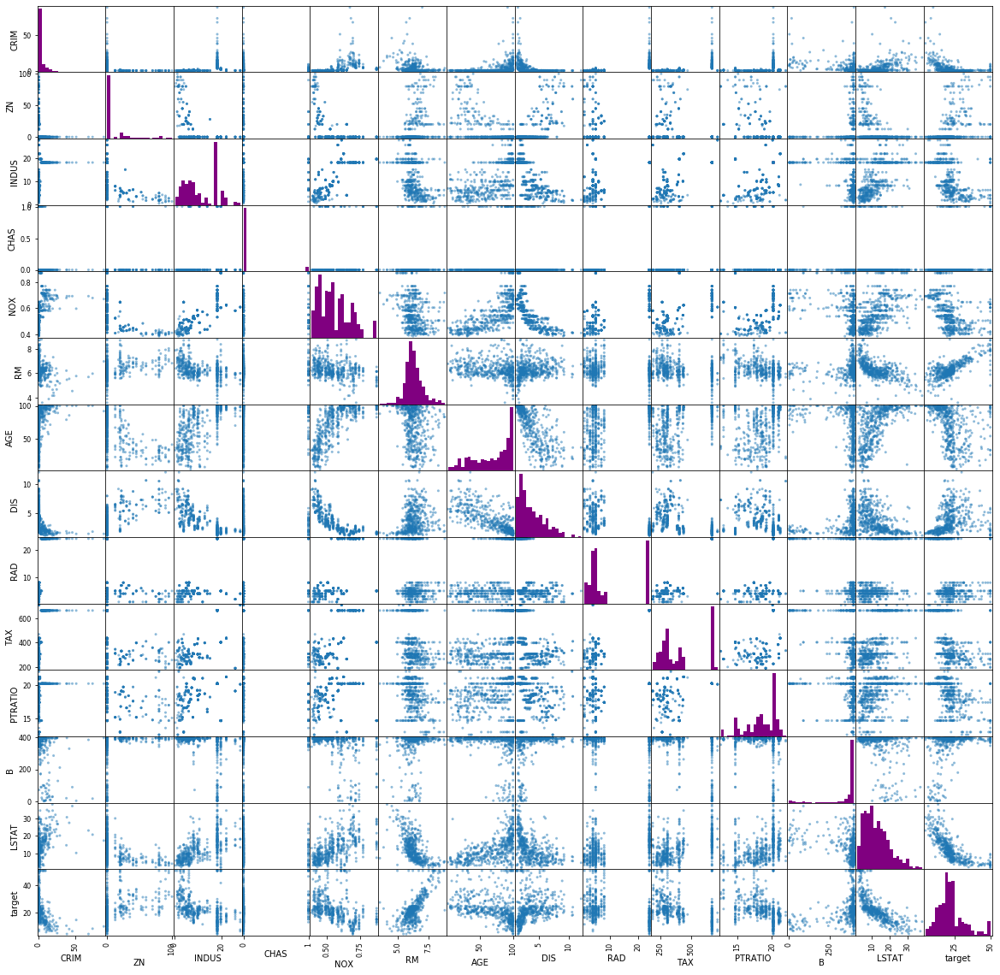


```python
# Make a function that plots a specific column of the dataframe as a histogram
# Make the color of it purple by default, alpha value should be 0.8 by default
# Make a parameter to toggle a grid
# Make parameters for axis labels and the title of the histogram
# Make a parameter for number of bins and default it to 20
# call the function `plot_histogram`

def plot_histogram(df, column, bins=20, color="purple", grid=True, title=None, xlabel=None, ylabel="counts"):
    plt.figure(figsize=(8, 5))
    if grid:
        plt.grid(zorder=0)
    plt.hist(x=df[column], bins=bins, color=color, zorder=2)
    if title is None:
        title = f"Histogram for {column}"
    plt.title(title)
    if xlabel is None:
        xlabel = column
    plt.xlabel(xlabel.lower())
    plt.ylabel(ylabel)
    plt.show()
```


```python
plot_histogram(df, "AGE")
```


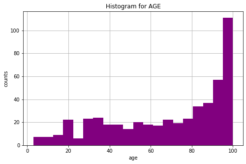


```python
# Plot a hexbin plot of AGE vs Indus colored by target values

df.plot.hexbin(x='AGE', y='CRIM', C='target', gridsize=20, figsize=(8, 5))
plt.show()
```


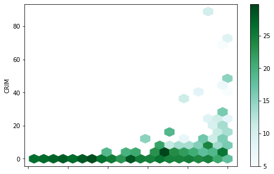


```python
df.corr()
```


<div>
<style scoped>
    .dataframe tbody tr th:only-of-type {
        vertical-align: middle;
    }

    .dataframe tbody tr th {
        vertical-align: top;
    }

    .dataframe thead th {
        text-align: right;
    }
</style>
<table border="1" class="dataframe">
  <thead>
    <tr style="text-align: right;">
      <th></th>
      <th>CRIM</th>
      <th>ZN</th>
      <th>INDUS</th>
      <th>CHAS</th>
      <th>NOX</th>
      <th>RM</th>
      <th>AGE</th>
      <th>DIS</th>
      <th>RAD</th>
      <th>TAX</th>
      <th>PTRATIO</th>
      <th>B</th>
      <th>LSTAT</th>
      <th>target</th>
      <th>room_age</th>
    </tr>
  </thead>
  <tbody>
    <tr>
      <td>CRIM</td>
      <td>1.000000</td>
      <td>-0.200469</td>
      <td>0.406583</td>
      <td>-0.055892</td>
      <td>0.420972</td>
      <td>-0.219247</td>
      <td>0.352734</td>
      <td>-0.379670</td>
      <td>0.625505</td>
      <td>0.582764</td>
      <td>0.289946</td>
      <td>-0.385064</td>
      <td>0.455621</td>
      <td>-0.388305</td>
      <td>0.349253</td>
    </tr>
    <tr>
      <td>ZN</td>
      <td>-0.200469</td>
      <td>1.000000</td>
      <td>-0.533828</td>
      <td>-0.042697</td>
      <td>-0.516604</td>
      <td>0.311991</td>
      <td>-0.569537</td>
      <td>0.664408</td>
      <td>-0.311948</td>
      <td>-0.314563</td>
      <td>-0.391679</td>
      <td>0.175520</td>
      <td>-0.412995</td>
      <td>0.360445</td>
      <td>-0.564971</td>
    </tr>
    <tr>
      <td>INDUS</td>
      <td>0.406583</td>
      <td>-0.533828</td>
      <td>1.000000</td>
      <td>0.062938</td>
      <td>0.763651</td>
      <td>-0.391676</td>
      <td>0.644779</td>
      <td>-0.708027</td>
      <td>0.595129</td>
      <td>0.720760</td>
      <td>0.383248</td>
      <td>-0.356977</td>
      <td>0.603800</td>
      <td>-0.483725</td>
      <td>0.638643</td>
    </tr>
    <tr>
      <td>CHAS</td>
      <td>-0.055892</td>
      <td>-0.042697</td>
      <td>0.062938</td>
      <td>1.000000</td>
      <td>0.091203</td>
      <td>0.091251</td>
      <td>0.086518</td>
      <td>-0.099176</td>
      <td>-0.007368</td>
      <td>-0.035587</td>
      <td>-0.121515</td>
      <td>0.048788</td>
      <td>-0.053929</td>
      <td>0.175260</td>
      <td>0.089305</td>
    </tr>
    <tr>
      <td>NOX</td>
      <td>0.420972</td>
      <td>-0.516604</td>
      <td>0.763651</td>
      <td>0.091203</td>
      <td>1.000000</td>
      <td>-0.302188</td>
      <td>0.731470</td>
      <td>-0.769230</td>
      <td>0.611441</td>
      <td>0.668023</td>
      <td>0.188933</td>
      <td>-0.380051</td>
      <td>0.590879</td>
      <td>-0.427321</td>
      <td>0.728079</td>
    </tr>
    <tr>
      <td>RM</td>
      <td>-0.219247</td>
      <td>0.311991</td>
      <td>-0.391676</td>
      <td>0.091251</td>
      <td>-0.302188</td>
      <td>1.000000</td>
      <td>-0.240265</td>
      <td>0.205246</td>
      <td>-0.209847</td>
      <td>-0.292048</td>
      <td>-0.355501</td>
      <td>0.128069</td>
      <td>-0.613808</td>
      <td>0.695360</td>
      <td>-0.216539</td>
    </tr>
    <tr>
      <td>AGE</td>
      <td>0.352734</td>
      <td>-0.569537</td>
      <td>0.644779</td>
      <td>0.086518</td>
      <td>0.731470</td>
      <td>-0.240265</td>
      <td>1.000000</td>
      <td>-0.747881</td>
      <td>0.456022</td>
      <td>0.506456</td>
      <td>0.261515</td>
      <td>-0.273534</td>
      <td>0.602339</td>
      <td>-0.376955</td>
      <td>0.999703</td>
    </tr>
    <tr>
      <td>DIS</td>
      <td>-0.379670</td>
      <td>0.664408</td>
      <td>-0.708027</td>
      <td>-0.099176</td>
      <td>-0.769230</td>
      <td>0.205246</td>
      <td>-0.747881</td>
      <td>1.000000</td>
      <td>-0.494588</td>
      <td>-0.534432</td>
      <td>-0.232471</td>
      <td>0.291512</td>
      <td>-0.496996</td>
      <td>0.249929</td>
      <td>-0.747017</td>
    </tr>
    <tr>
      <td>RAD</td>
      <td>0.625505</td>
      <td>-0.311948</td>
      <td>0.595129</td>
      <td>-0.007368</td>
      <td>0.611441</td>
      <td>-0.209847</td>
      <td>0.456022</td>
      <td>-0.494588</td>
      <td>1.000000</td>
      <td>0.910228</td>
      <td>0.464741</td>
      <td>-0.444413</td>
      <td>0.488676</td>
      <td>-0.381626</td>
      <td>0.453370</td>
    </tr>
    <tr>
      <td>TAX</td>
      <td>0.582764</td>
      <td>-0.314563</td>
      <td>0.720760</td>
      <td>-0.035587</td>
      <td>0.668023</td>
      <td>-0.292048</td>
      <td>0.506456</td>
      <td>-0.534432</td>
      <td>0.910228</td>
      <td>1.000000</td>
      <td>0.460853</td>
      <td>-0.441808</td>
      <td>0.543993</td>
      <td>-0.468536</td>
      <td>0.502028</td>
    </tr>
    <tr>
      <td>PTRATIO</td>
      <td>0.289946</td>
      <td>-0.391679</td>
      <td>0.383248</td>
      <td>-0.121515</td>
      <td>0.188933</td>
      <td>-0.355501</td>
      <td>0.261515</td>
      <td>-0.232471</td>
      <td>0.464741</td>
      <td>0.460853</td>
      <td>1.000000</td>
      <td>-0.177383</td>
      <td>0.374044</td>
      <td>-0.507787</td>
      <td>0.254090</td>
    </tr>
    <tr>
      <td>B</td>
      <td>-0.385064</td>
      <td>0.175520</td>
      <td>-0.356977</td>
      <td>0.048788</td>
      <td>-0.380051</td>
      <td>0.128069</td>
      <td>-0.273534</td>
      <td>0.291512</td>
      <td>-0.444413</td>
      <td>-0.441808</td>
      <td>-0.177383</td>
      <td>1.000000</td>
      <td>-0.366087</td>
      <td>0.333461</td>
      <td>-0.271888</td>
    </tr>
    <tr>
      <td>LSTAT</td>
      <td>0.455621</td>
      <td>-0.412995</td>
      <td>0.603800</td>
      <td>-0.053929</td>
      <td>0.590879</td>
      <td>-0.613808</td>
      <td>0.602339</td>
      <td>-0.496996</td>
      <td>0.488676</td>
      <td>0.543993</td>
      <td>0.374044</td>
      <td>-0.366087</td>
      <td>1.000000</td>
      <td>-0.737663</td>
      <td>0.590384</td>
    </tr>
    <tr>
      <td>target</td>
      <td>-0.388305</td>
      <td>0.360445</td>
      <td>-0.483725</td>
      <td>0.175260</td>
      <td>-0.427321</td>
      <td>0.695360</td>
      <td>-0.376955</td>
      <td>0.249929</td>
      <td>-0.381626</td>
      <td>-0.468536</td>
      <td>-0.507787</td>
      <td>0.333461</td>
      <td>-0.737663</td>
      <td>1.000000</td>
      <td>-0.361660</td>
    </tr>
    <tr>
      <td>room_age</td>
      <td>0.349253</td>
      <td>-0.564971</td>
      <td>0.638643</td>
      <td>0.089305</td>
      <td>0.728079</td>
      <td>-0.216539</td>
      <td>0.999703</td>
      <td>-0.747017</td>
      <td>0.453370</td>
      <td>0.502028</td>
      <td>0.254090</td>
      <td>-0.271888</td>
      <td>0.590384</td>
      <td>-0.361660</td>
      <td>1.000000</td>
    </tr>
  </tbody>
</table>
</div>


```python
# Plot a correlation heatmap using the `.corr()` method and seaborn's heatmap
# Annotate your heatmap using 2 floating points
# Use the 'Blues' color scheme for your heatmap

corr = df.corr()

plt.figure(figsize=(20, 20))
sns.heatmap(corr, annot=True, fmt='0.2g', cmap=sns.color_palette("Purples"))
plt.show()
```


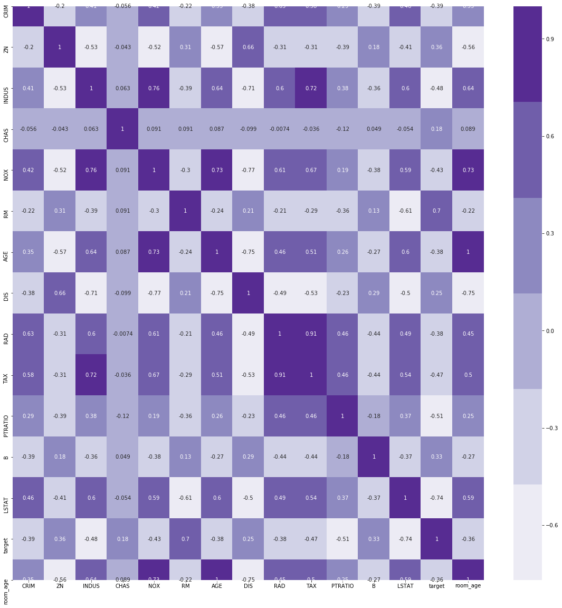

# New Image

<p align="center>

</p>                                  


```python
demo_df = pd.read_csv("demo.csv")
demo_df.head()
```


<div>
<style scoped>
    .dataframe tbody tr th:only-of-type {
        vertical-align: middle;
    }

    .dataframe tbody tr th {
        vertical-align: top;
    }

    .dataframe thead th {
        text-align: right;
    }
</style>
<table border="1" class="dataframe">
  <thead>
    <tr style="text-align: right;">
      <th></th>
      <th>column1</th>
      <th>column2</th>
      <th>column3</th>
      <th>column4</th>
    </tr>
  </thead>
  <tbody>
    <tr>
      <td>0</td>
      <td>0</td>
      <td>1</td>
      <td>2</td>
      <td>'this'</td>
    </tr>
    <tr>
      <td>1</td>
      <td>1</td>
      <td>2</td>
      <td>3</td>
      <td>'that'</td>
    </tr>
    <tr>
      <td>2</td>
      <td>3</td>
      <td>4</td>
      <td>5</td>
      <td>'the other'</td>
    </tr>
    <tr>
      <td>3</td>
      <td>6</td>
      <td>7</td>
      <td>8</td>
      <td>'the other other'</td>
    </tr>
    <tr>
      <td>4</td>
      <td>9</td>
      <td>10</td>
      <td>11</td>
      <td>'ant man'</td>
    </tr>
  </tbody>
</table>
</div>


```python
demo_df[" column4"].str.title().str.swapcase()
```


    0                'tHIS'
    1                'tHAT'
    2           'tHE oTHER'
    3     'tHE oTHER oTHER'
    4             'aNT mAN'
    5                'hULK'
    6       'sCARLET wITCH'
    Name:  column4, dtype: object


```python
## let's make a new column using a lambda function

df["rooms_rounded"] = df["RM"].apply(lambda x : x//1)

df["rooms_doubled_rounded"] = df["RM"].apply(lambda x : (2*x)//1)


df.head()
```


<div>
<style scoped>
    .dataframe tbody tr th:only-of-type {
        vertical-align: middle;
    }

    .dataframe tbody tr th {
        vertical-align: top;
    }

    .dataframe thead th {
        text-align: right;
    }
</style>
<table border="1" class="dataframe">
  <thead>
    <tr style="text-align: right;">
      <th></th>
      <th>CRIM</th>
      <th>ZN</th>
      <th>INDUS</th>
      <th>CHAS</th>
      <th>NOX</th>
      <th>RM</th>
      <th>AGE</th>
      <th>DIS</th>
      <th>RAD</th>
      <th>TAX</th>
      <th>PTRATIO</th>
      <th>B</th>
      <th>LSTAT</th>
      <th>target</th>
      <th>room_categories</th>
      <th>room_age</th>
      <th>rooms_rounded</th>
      <th>rooms_doubled_rounded</th>
    </tr>
  </thead>
  <tbody>
    <tr>
      <td>0</td>
      <td>0.00632</td>
      <td>18.0</td>
      <td>2.31</td>
      <td>0.0</td>
      <td>0.538</td>
      <td>6.575</td>
      <td>65.2</td>
      <td>4.0900</td>
      <td>1.0</td>
      <td>296.0</td>
      <td>15.3</td>
      <td>396.90</td>
      <td>4.98</td>
      <td>24.0</td>
      <td>medium</td>
      <td>71.775</td>
      <td>6.0</td>
      <td>13.0</td>
    </tr>
    <tr>
      <td>1</td>
      <td>0.02731</td>
      <td>0.0</td>
      <td>7.07</td>
      <td>0.0</td>
      <td>0.469</td>
      <td>6.421</td>
      <td>78.9</td>
      <td>4.9671</td>
      <td>2.0</td>
      <td>242.0</td>
      <td>17.8</td>
      <td>396.90</td>
      <td>9.14</td>
      <td>21.6</td>
      <td>medium</td>
      <td>85.321</td>
      <td>6.0</td>
      <td>12.0</td>
    </tr>
    <tr>
      <td>2</td>
      <td>0.02729</td>
      <td>0.0</td>
      <td>7.07</td>
      <td>0.0</td>
      <td>0.469</td>
      <td>7.185</td>
      <td>61.1</td>
      <td>4.9671</td>
      <td>2.0</td>
      <td>242.0</td>
      <td>17.8</td>
      <td>392.83</td>
      <td>4.03</td>
      <td>34.7</td>
      <td>medium</td>
      <td>68.285</td>
      <td>7.0</td>
      <td>14.0</td>
    </tr>
    <tr>
      <td>3</td>
      <td>0.03237</td>
      <td>0.0</td>
      <td>2.18</td>
      <td>0.0</td>
      <td>0.458</td>
      <td>6.998</td>
      <td>45.8</td>
      <td>6.0622</td>
      <td>3.0</td>
      <td>222.0</td>
      <td>18.7</td>
      <td>394.63</td>
      <td>2.94</td>
      <td>33.4</td>
      <td>medium</td>
      <td>52.798</td>
      <td>6.0</td>
      <td>13.0</td>
    </tr>
    <tr>
      <td>4</td>
      <td>0.06905</td>
      <td>0.0</td>
      <td>2.18</td>
      <td>0.0</td>
      <td>0.458</td>
      <td>7.147</td>
      <td>54.2</td>
      <td>6.0622</td>
      <td>3.0</td>
      <td>222.0</td>
      <td>18.7</td>
      <td>396.90</td>
      <td>5.33</td>
      <td>36.2</td>
      <td>medium</td>
      <td>61.347</td>
      <td>7.0</td>
      <td>14.0</td>
    </tr>
  </tbody>
</table>
</div>


```python

```

### Assessment
* what is the different between a list object and a numpy.array object?
* what is the benefit of using numpy vs writing your own methods?
* what is the index of a dataframe? What is a rule for the index? What are columns? 
* how do we find the mean of a specific column in a dataframe?
* plot a hist, scatterplot, lineplot, hexmap, heatmap
